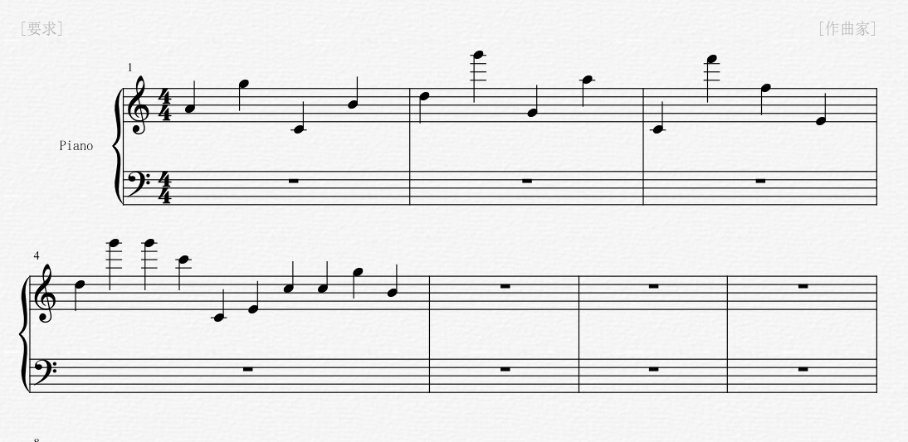
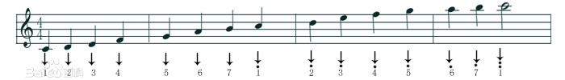
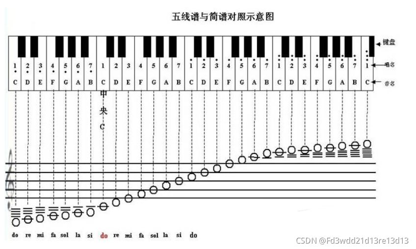

# Crypto-你懂我的乐谱吗？-解题思路
题目描述:
```
你懂我的乐谱吗？
```
资源:
`乐谱.zip`
## 解题过程
```bash
$ unzip 乐谱.zip -d export

$ tree export
.
│ export/
│ │ 乐谱.png
```
使用图片查看器查看`export/乐谱.png`,图片内容如下:



无法解决:

根据网友提示,学习五线谱知识:





按照上图,只看数字标识,关于音符,只看音符的黑球被哪条线线穿过,以及在哪条线上方.

由此,将`export/乐谱.png`内容翻译为:
```
          .       .
  .     . .   .   . .
6 5 1 7 2 5 5 6 1 4 4 3

  . . .
. . . .     . . .
2 5 5 1 1 3 1 1 5 7
```

按照如下的音符数字标识和字母的转换表:
```
                                          . . . . .
                            . . . . . . . . . . . .
              . . . . . . . . . . . . . . . . . . .
1 2 3 4 5 6 7 1 2 3 4 5 6 7 1 2 3 4 5 6 7 1 2 3 4 5
A B C D E F G H I J K L M N O P Q R S T U V W X Y Z
```
翻译为字母后:
```
          .       .
  .     . .   .   . .
6 5 1 7 2 5 5 6 1 4 4 3
F L A G I S E M A R K C

  . . .
. . . .     . . .
2 5 5 1 1 3 1 1 5 7
I S S O A C H H L G
```
```
FLAG IS EMARKCISSOACHHLG
```
尝试提交`flag{EMARKCISSOACHHLG}`和`flag{emarkcissoachhlg}`.

第一个大写版本提交通过,答题结束.
