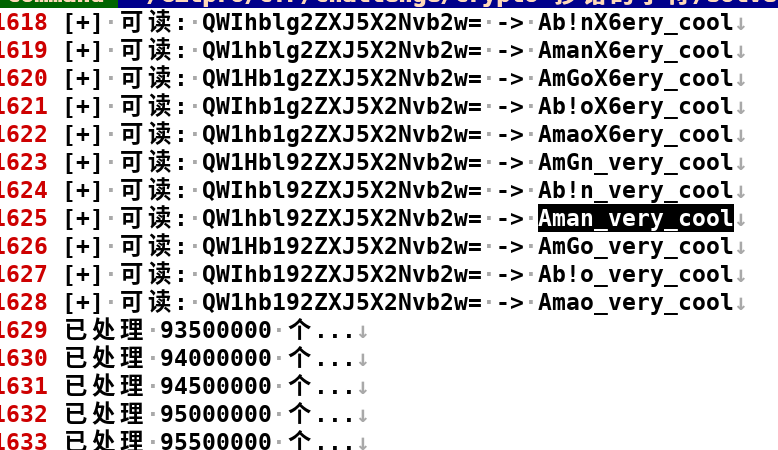

# Crypto-抄错的字符-解题思路

题目描述:
```
老师让小明抄写一段话，结果粗心的小明把部分数字抄成了字母，
还因为强迫症把所有字母都换成大写。
你能帮小明恢复并解开答案吗：QWIHBLGZZXJSXZNVBZW
```

`QWIHBLGZZXJSXZNVBZW`
长度是19字符.

可以逆过程,
把所有的大写字母转换为小写:`qwihblgzzxjsxznvbzw`.

找出和数字容易混淆的字母:
`qwihblgzzxjsxznvbzw`
`9w1h61922xj5x2nv62w`
`4w1h61922xj5x2nv62w`

q->9/4 Q->0/4/9

i->1 I->1

l->1 L->1

b->6 B->8

g->9 G->6/0

z->2 Z->2

s->5 S->5

总结一下:
```
str[19]=QWIHBLGZZXJSXZNVBZW

idx key->val
0   Q  ->Q,q,4,9,0
1   W  ->W,w
2   I  ->I,i,1
3   H  ->H,h
4   B  ->B,b,6
5   L  ->L,l,1
6   G  ->G,g,6,9
7   Z  ->Z,z,2
8   Z  ->...
9   X  ->X,x
10  J  ->J,j
11  S  ->S,s,5
12  X  ->...
13  Z  ->...
14  N  ->N,n
15  V  ->V,v
16  B  ->...
17  Z  ->...
18  W  ->...

map
key->val
Q  ->Q,q,4,9,0
W  ->W,w
I  ->I,i,1
H  ->H,h
B  ->B,b,6
L  ->L,l,1
G  ->G,g,6,9
Z  ->Z,z,2
X  ->X,x
J  ->J,j
S  ->S,s,5
N  ->N,n
V  ->V,v

# 如何构建每一个需要解码的arr[19]串呢?
vec:vec[arr[19]]

vec=[]
for ch : str
    ?迭代嵌套19层?
构建递归实现:
```
编码类型猜测`base64`(这个编码类型一开始也不确定,来自题解),
因为秘文最开始是19位,长度不是4的倍数,因此率先想到的是`base58`,
暴力破解之后,没有得到有用的信息.

我分别使用`python`和`cpp`撰写了`solve`脚本
(暴力枚举+`base64`解码(末尾自动补齐'=')).
```bash
$ python3 solve.py > solve_py_output.txt
$ ./build.sh > solve_cpp_output.txt
```
根据`BugKu`题解提示,`flag{}`为`flag{Aman_very_cool}`

查看脚本运行结果,搜索是否存在上述`flag`.
```bash
$ rg Aman_very_cool
solve_cpp_output.txt
1624:[+] 可读: QW1hbl92ZXJ5X2Nvb2w= -> Aman_very_cool

solve_py_output.txt
1857:    QW1hbl92ZXJ5X2Nvb2w= -> Aman_very_cool
1858:    QW1hbl92ZXJ5X2Nvb2w== -> Aman_very_cool
```

看来我们的脚本实现是正确的.
提交`flag{Aman_very_cool}`,成功通过,答题结束.
