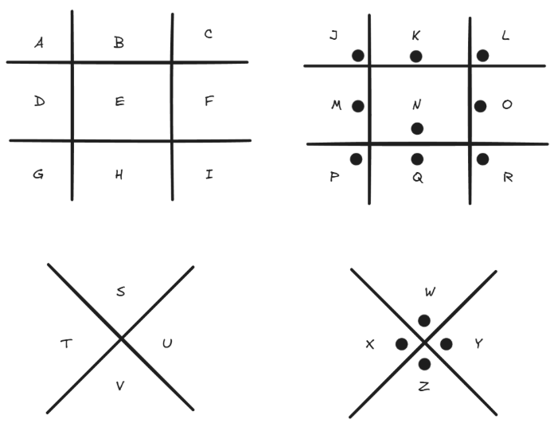

# Crypto-把猪困在猪圈里-解题思路

题目描述:
```
flag{}
```

资源:
`file.txt`的文件内容如下:
```txt
/9j/4AAQSkZJRgABAQEAYABgAAD/4RDaRXhpZgAATU0AKgAAAAgABAE7AAIAAAAFAAAISodpAAQAAAABAAAIUJydAAEAAAAKAAAQyOocAAcAAAgMAAAAPgAAAAAc6gAAAAgAAAAAAAAAAAAAAAAAAAAAAAAAAAAAAAAAAAAAAAAAAAAAAAAAAAAAAAAAAAAAAAAAAAAAAAAAAAAAAAAAAAAAAAAAAAAAAAAAAAAAAAAAAAAAAAAAAAAAAAAAAAAAAAAAAAAAAAAAAAAAAAAAAAAAAAAAAAAAAAAAAAAAAAAAAAAAAAAAAAAAAAAAAAAAAAAAAAAAAAAAAAAAAAAAAAAAAAAAAAAAAAAAAAAAAAAAAAAAAAAAAAAAAAAAAAAAAAAAAAAAAAAAAAAAAAAAAAAAAAAAAAAAAAAAAAAAAAAAAAAAAAAAAAAAAAAAAAAAAAAAAAAAAAAAAAAAAAAAAAAAAAAAAAAAAAAAAAAAAAAAAAAAAAAAAAAAAAAAAAAAAAAAAAAAAAAAAAAAAAAAAAAAAAAAAAAAAAAAAAAAAAAAAAAAAAAAAAAAAAAAAAAAAAAAAAAAAAAAAAAAAAAAAAAAAAAAAAAAAAAAAAAAAAAAAAAAAAAAAAAAAAAAAAAAAAAAAAAAAAAAAAAAAAAAAAAAAAAAAAAAAAAAAAAAAAAAAAAAAAAAAAAAAAAAAAAAAAAAAAAAAAAAAAAAAAAAAAAAAAAAAAAAAAAAAAAAAAAAAAAAAAAAAAAAAAAAAAAAAAAAAAAAAAAAAAAAAAAAAAAAAAAAAAAAAAAAAAAAAAAAAAAAAAAAAAAAAAAAAAAAAAAAAAAAAAAAAAAAAAAAAAAAAAAAAAAAAAAAAAAAAAAAAAAAAAAAAAAAAAAAAAAAAAAAAAAAAAAAAAAAAAAAAAAAAAAAAAAAAAAAAAAAAAAAAAAAAAAAAAAAAAAAAAAAAAAAAAAAAAAAAAAAAAAAAAAAAAAAAAAAAAAAAAAAAAAAAAAAAAAAAAAAAAAAAAAAAAAAAAAAAAAAAAAAAAAAAAAAAAAAAAAAAAAAAAAAAAAAAAAAAAAAAAAAAAAAAAAAAAAAAAAAAAAAAAAAAAAAAAAAAAAAAAAAAAAAAAAAAAAAAAAAAAAAAAAAAAAAAAAAAAAAAAAAAAAAAAAAAAAAAAAAAAAAAAAAAAAAAAAAAAAAAAAAAAAAAAAAAAAAAAAAAAAAAAAAAAAAAAAAAAAAAAAAAAAAAAAAAAAAAAAAAAAAAAAAAAAAAAAAAAAAAAAAAAAAAAAAAAAAAAAAAAAAAAAAAAAAAAAAAAAAAAAAAAAAAAAAAAAAAAAAAAAAAAAAAAAAAAAAAAAAAAAAAAAAAAAAAAAAAAAAAAAAAAAAAAAAAAAAAAAAAAAAAAAAAAAAAAAAAAAAAAAAAAAAAAAAAAAAAAAAAAAAAAAAAAAAAAAAAAAAAAAAAAAAAAAAAAAAAAAAAAAAAAAAAAAAAAAAAAAAAAAAAAAAAAAAAAAAAAAAAAAAAAAAAAAAAAAAAAAAAAAAAAAAAAAAAAAAAAAAAAAAAAAAAAAAAAAAAAAAAAAAAAAAAAAAAAAAAAAAAAAAAAAAAAAAAAAAAAAAAAAAAAAAAAAAAAAAAAAAAAAAAAAAAAAAAAAAAAAAAAAAAAAAAAAAAAAAAAAAAAAAAAAAAAAAAAAAAAAAAAAAAAAAAAAAAAAAAAAAAAAAAAAAAAAAAAAAAAAAAAAAAAAAAAAAAAAAAAAAAAAAAAAAAAAAAAAAAAAAAAAAAAAAAAAAAAAAAAAAAAAAAAAAAAAAAAAAAAAAAAAAAAAAAAAAAAAAAAAAAAAAAAAAAAAAAAAAAAAAAAAAAAAAAAAAAAAAAAAAAAAAAAAAAAAAAAAAAAAAAAAAAAAAAAAAAAAAAAAAAAAAAAAAAAAAAAAAAAAAAAAAAAAAAAAAAAAAAAAAAAAAAAAAAAAAAAAAAAAAAAAAAAAAAAAAAAAAAAAAAAAAAAAAAAAAAAAAAAAAAAAAAAAAAAAAAAAAAAAAAAAAAAAAAAAAAAAAAAAAAAAAAAAAAAAAAAAAAAAAAAAAAAAAAAAAAAAAAAAAAAAAAAAAAAAAAAAAAAAAAAAAAAAAAAAAAAAAAAAAAAAAAAAAAAAAAAAAAAAAAAAAAAAAAAAAAAAAAAAAAAAAAAAAAAAAAAAAAAAAAAAAAAAAAAAAAAAAAAAAAAAAAAAAAAAAAAAAAAAAAAAAAAAAAAAAAAAAAAAAAAAAAAAAAAAAAAAAAAAAAAAAAAAAAAAAAAAAAAAAAAAAAAAAAAAAAAAAAAAAAAAAAAAAAAAAAAAAAAAAAAAAAAAAAAAAAAAAAAAAAAAAAAAAAAAAAAAAAAAAAAAAAAAAAAAAAAAAAAAAAAAAAAAAAAAAAAAAAAAAAAAAAAAAAAAAAAAAAAAAAAAAAAAAAAAAAAAAAAAAAAAAAAAAAAAAAAAAAAAAAAAAAAAAAAAAAAAAAAAAAAAAAAAAAAAAAAAAAAAAAAAAAAAAAAAAAAAAAAAAAAAAAAAAAAAAAAAAAAAAAAAAAAAAAAAAAAAAAAAAAAAAAAAAAAAAAAAAAAAAAAAAAAAAAAAAAAAAAAAAAAAAAAAAAAAAAAAAAAAAAAAAAAAAAAAAAAAAAAAAAAAAAAAAAAAAAAAAAAAAAAAAAAAAAAAAAAAAAAAAAAAAAAAAAAAAAAAAAAAAAAAAAAAAAAAAAAAAAAAAAAAAAAAAAAAAAAAAAAAAAAAAAAAAAAAAAAAAAAAAAAAAAAAAAAAAAAAAAAAAAAAAAAAAAAAAAAAAAAAAAAAAAAAAAAAAAAAAAAAAAAAAAAAAAAAAAAAAAAAAAAAAAAAAAAAAAFIwMFQAAAAFkAMAAgAAABQAABCekAQAAgAAABQAABCykpEAAgAAAAM0MQAAkpIAAgAAAAM0MQAA6hwABwAACAwAAAiSAAAAABzqAAAACAAAAAAAAAAAAAAAAAAAAAAAAAAAAAAAAAAAAAAAAAAAAAAAAAAAAAAAAAAAAAAAAAAAAAAAAAAAAAAAAAAAAAAAAAAAAAAAAAAAAAAAAAAAAAAAAAAAAAAAAAAAAAAAAAAAAAAAAAAAAAAAAAAAAAAAAAAAAAAAAAAAAAAAAAAAAAAAAAAAAAAAAAAAAAAAAAAAAAAAAAAAAAAAAAAAAAAAAAAAAAAAAAAAAAAAAAAAAAAAAAAAAAAAAAAAAAAAAAAAAAAAAAAAAAAAAAAAAAAAAAAAAAAAAAAAAAAAAAAAAAAAAAAAAAAAAAAAAAAAAAAAAAAAAAAAAAAAAAAAAAAAAAAAAAAAAAAAAAAAAAAAAAAAAAAAAAAAAAAAAAAAAAAAAAAAAAAAAAAAAAAAAAAAAAAAAAAAAAAAAAAAAAAAAAAAAAAAAAAAAAAAAAAAAAAAAAAAAAAAAAAAAAAAAAAAAAAAAAAAAAAAAAAAAAAAAAAAAAAAAAAAAAAAAAAAAAAAAAAAAAAAAAAAAAAAAAAAAAAAAAAAAAAAAAAAAAAAAAAAAAAAAAAAAAAAAAAAAAAAAAAAAAAAAAAAAAAAAAAAAAAAAAAAAAAAAAAAAAAAAAAAAAAAAAAAAAAAAAAAAAAAAAAAAAAAAAAAAAAAAAAAAAAAAAAAAAAAAAAAAAAAAAAAAAAAAAAAAAAAAAAAAAAAAAAAAAAAAAAAAAAAAAAAAAAAAAAAAAAAAAAAAAAAAAAAAAAAAAAAAAAAAAAAAAAAAAAAAAAAAAAAAAAAAAAAAAAAAAAAAAAAAAAAAAAAAAAAAAAAAAAAAAAAAAAAAAAAAAAAAAAAAAAAAAAAAAAAAAAAAAAAAAAAAAAAAAAAAAAAAAAAAAAAAAAAAAAAAAAAAAAAAAAAAAAAAAAAAAAAAAAAAAAAAAAAAAAAAAAAAAAAAAAAAAAAAAAAAAAAAAAAAAAAAAAAAAAAAAAAAAAAAAAAAAAAAAAAAAAAAAAAAAAAAAAAAAAAAAAAAAAAAAAAAAAAAAAAAAAAAAAAAAAAAAAAAAAAAAAAAAAAAAAAAAAAAAAAAAAAAAAAAAAAAAAAAAAAAAAAAAAAAAAAAAAAAAAAAAAAAAAAAAAAAAAAAAAAAAAAAAAAAAAAAAAAAAAAAAAAAAAAAAAAAAAAAAAAAAAAAAAAAAAAAAAAAAAAAAAAAAAAAAAAAAAAAAAAAAAAAAAAAAAAAAAAAAAAAAAAAAAAAAAAAAAAAAAAAAAAAAAAAAAAAAAAAAAAAAAAAAAAAAAAAAAAAAAAAAAAAAAAAAAAAAAAAAAAAAAAAAAAAAAAAAAAAAAAAAAAAAAAAAAAAAAAAAAAAAAAAAAAAAAAAAAAAAAAAAAAAAAAAAAAAAAAAAAAAAAAAAAAAAAAAAAAAAAAAAAAAAAAAAAAAAAAAAAAAAAAAAAAAAAAAAAAAAAAAAAAAAAAAAAAAAAAAAAAAAAAAAAAAAAAAAAAAAAAAAAAAAAAAAAAAAAAAAAAAAAAAAAAAAAAAAAAAAAAAAAAAAAAAAAAAAAAAAAAAAAAAAAAAAAAAAAAAAAAAAAAAAAAAAAAAAAAAAAAAAAAAAAAAAAAAAAAAAAAAAAAAAAAAAAAAAAAAAAAAAAAAAAAAAAAAAAAAAAAAAAAAAAAAAAAAAAAAAAAAAAAAAAAAAAAAAAAAAAAAAAAAAAAAAAAAAAAAAAAAAAAAAAAAAAAAAAAAAAAAAAAAAAAAAAAAAAAAAAAAAAAAAAAAAAAAAAAAAAAAAAAAAAAAAAAAAAAAAAAAAAAAAAAAAAAAAAAAAAAAAAAAAAAAAAAAAAAAAAAAAAAAAAAAAAAAAAAAAAAAAAAAAAAAAAAAAAAAAAAAAAAAAAAAAAAAAAAAAAAAAAAAAAAAAAAAAAAAAAAAAAAAAAAAAAAAAAAAAAAAAAAAAAAAAAAAAAAAAAAAAAAAAAAAAAAAAAAAAAAAAAAAAAAAAAAAAAAAAAAAAAAAAAAAAAAAAAAAAAAAAAAAAAAAAAAAAAAAAAAAAAAAAAAAAAAAAAAAAAAAAAAAAAAAAAAAAAAAAAAAAAAAAAAAAAAAAAAAAAAAAAAAAAAAAAAAAAAAAAAAAAAAAAAAAAAAAAAAAAAAAAAAAAAAAAAAAAAAAAAAAAAAAAAAAAAAAAAAAAAAAAAAAAAAAAAAAAAAAAAAAAAAAAAAAAAAAAAAAAAAAAAAAAAAAAAAAAAAAAAAAAAAAAAAAAAAAAAAAAAAAAAAAAAAAAAAAAAAAAAAAAAAAAAAAAAAAAAAAAAAAAAAAAAAAAAAAAAAAAAAAAAAAAAAAAAAAAAAAAAAAAAAAAAAAAAAAAAAAAAAAAAAAAAAAAAAAAAAAAAAAAAAAAAAAAAAAAAAAAAAAAAAAAAAAAAAAAAAAAAAAAAAAAAAAAAAAAAAAAAAAAAAAAAAAAAAAAAAAAAAAAAAAAAAAAAAAAAAAAAAAAAAAAAAAAAAAAAAAAAAAAAAAAAAAAAAAAAAAAAAAAAAAAAAAAAAAAAAAAAAAAAAAAAAAAAAAAAAAAAAAAAAAAAAAAAAAAAAAAAAAAAAAAAAAAAAAAAAAAAAAAAAAAAAAAAAAAAAAAAAAAAAAAAAAAAAAAAAAAAAAAAAAAAAAAAAAAAAAAAAAAAAAAAAAAAAAAAAAAAAAAAAAAAAAAAAAAAAAAAAAAAAAAAAAAAAAAAAAAAAAAAAAAAAAAAAAAAAAAAAAAAMjAyMTowMToxMCAyMjo0MDo1OQAyMDIxOjAxOjEwIDIyOjQwOjU5AAAAUgAwADAAVAAAAP/hCxdodHRwOi8vbnMuYWRvYmUuY29tL3hhcC8xLjAvADw/eHBhY2tldCBiZWdpbj0n77u/JyBpZD0nVzVNME1wQ2VoaUh6cmVTek5UY3prYzlkJz8+DQo8eDp4bXBtZXRhIHhtbG5zOng9ImFkb2JlOm5zOm1ldGEvIj48cmRmOlJERiB4bWxuczpyZGY9Imh0dHA6Ly93d3cudzMub3JnLzE5OTkvMDIvMjItcmRmLXN5bnRheC1ucyMiPjxyZGY6RGVzY3JpcHRpb24gcmRmOmFib3V0PSJ1dWlkOmZhZjViZGQ1LWJhM2QtMTFkYS1hZDMxLWQzM2Q3NTE4MmYxYiIgeG1sbnM6ZGM9Imh0dHA6Ly9wdXJsLm9yZy9kYy9lbGVtZW50cy8xLjEvIi8+PHJkZjpEZXNjcmlwdGlvbiByZGY6YWJvdXQ9InV1aWQ6ZmFmNWJkZDUtYmEzZC0xMWRhLWFkMzEtZDMzZDc1MTgyZjFiIiB4bWxuczp4bXA9Imh0dHA6Ly9ucy5hZG9iZS5jb20veGFwLzEuMC8iPjx4bXA6Q3JlYXRlRGF0ZT4yMDIxLTAxLTEwVDIyOjQwOjU5LjQxMTwveG1wOkNyZWF0ZURhdGU+PC9yZGY6RGVzY3JpcHRpb24+PHJkZjpEZXNjcmlwdGlvbiByZGY6YWJvdXQ9InV1aWQ6ZmFmNWJkZDUtYmEzZC0xMWRhLWFkMzEtZDMzZDc1MTgyZjFiIiB4bWxuczpkYz0iaHR0cDovL3B1cmwub3JnL2RjL2VsZW1lbnRzLzEuMS8iPjxkYzpjcmVhdG9yPjxyZGY6U2VxIHhtbG5zOnJkZj0iaHR0cDovL3d3dy53My5vcmcvMTk5OS8wMi8yMi1yZGYtc3ludGF4LW5zIyI+PHJkZjpsaT5SMDBUPC9yZGY6bGk+PC9yZGY6U2VxPg0KCQkJPC9kYzpjcmVhdG9yPjwvcmRmOkRlc2NyaXB0aW9uPjwvcmRmOlJERj48L3g6eG1wbWV0YT4NCiAgICAgICAgICAgICAgICAgICAgICAgICAgICAgICAgICAgICAgICAgICAgICAgICAgICAgICAgICAgICAgICAgICAgICAgICAgICAgICAgICAgICAgICAgICAgICAgICAgICAKICAgICAgICAgICAgICAgICAgICAgICAgICAgICAgICAgICAgICAgICAgICAgICAgICAgICAgICAgICAgICAgICAgICAgICAgICAgICAgICAgICAgICAgICAgICAgICAgICAgIAogICAgICAgICAgICAgICAgICAgICAgICAgICAgICAgICAgICAgICAgICAgICAgICAgICAgICAgICAgICAgICAgICAgICAgICAgICAgICAgICAgICAgICAgICAgICAgICAgICAgCiAgICAgICAgICAgICAgICAgICAgICAgICAgICAgICAgICAgICAgICAgICAgICAgICAgICAgICAgICAgICAgICAgICAgICAgICAgICAgICAgICAgICAgICAgICAgICAgICAgICAKICAgICAgICAgICAgICAgICAgICAgICAgICAgICAgICAgICAgICAgICAgICAgICAgICAgICAgICAgICAgICAgICAgICAgICAgICAgICAgICAgICAgICAgICAgICAgICAgICAgIAogICAgICAgICAgICAgICAgICAgICAgICAgICAgICAgICAgICAgICAgICAgICAgICAgICAgICAgICAgICAgICAgICAgICAgICAgICAgICAgICAgICAgICAgICAgICAgICAgICAgCiAgICAgICAgICAgICAgICAgICAgICAgICAgICAgICAgICAgICAgICAgICAgICAgICAgICAgICAgICAgICAgICAgICAgICAgICAgICAgICAgICAgICAgICAgICAgICAgICAgICAKICAgICAgICAgICAgICAgICAgICAgICAgICAgICAgICAgICAgICAgICAgICAgICAgICAgICAgICAgICAgICAgICAgICAgICAgICAgICAgICAgICAgICAgICAgICAgICAgICAgIAogICAgICAgICAgICAgICAgICAgICAgICAgICAgICAgICAgICAgICAgICAgICAgICAgICAgICAgICAgICAgICAgICAgICAgICAgICAgICAgICAgICAgICAgICAgICAgICAgICAgCiAgICAgICAgICAgICAgICAgICAgICAgICAgICAgICAgICAgICAgICAgICAgICAgICAgICAgICAgICAgICAgICAgICAgICAgICAgICAgICAgICAgICAgICAgICAgICAgICAgICAKICAgICAgICAgICAgICAgICAgICAgICAgICAgICAgICAgICAgICAgICAgICAgICAgICAgICAgICAgICAgICAgICAgICAgICAgICAgICAgICAgICAgICAgICAgICAgICAgICAgIAogICAgICAgICAgICAgICAgICAgICAgICAgICAgICAgICAgICAgICAgICAgICAgICAgICAgICAgICAgICAgICAgICAgICAgICAgICAgICAgICAgICAgICAgICAgICAgICAgICAgCiAgICAgICAgICAgICAgICAgICAgICAgICAgICAgICAgICAgICAgICAgICAgICAgICAgICAgICAgICAgICAgICAgICAgICAgICAgICAgICAgICAgICAgICAgICAgICAgICAgICAKICAgICAgICAgICAgICAgICAgICAgICAgICAgICAgICAgICAgICAgICAgICAgICAgICAgICAgICAgICAgICAgICAgICAgICAgICAgICAgICAgICAgICAgICAgICAgICAgICAgIAogICAgICAgICAgICAgICAgICAgICAgICAgICAgICAgICAgICAgICAgICAgICAgICAgICAgICAgICAgICAgICAgICAgICAgICAgICAgICAgICAgICAgICAgICAgICAgICAgICAgCiAgICAgICAgICAgICAgICAgICAgICAgICAgICAgICAgICAgICAgICAgICAgICAgICAgICAgICAgICAgICAgICAgICAgICAgICAgICAgICAgICAgICAgICAgICAgICAgICAgICAKICAgICAgICAgICAgICAgICAgICAgICAgICAgICAgICAgICAgICAgICAgICAgICAgICAgICAgICAgICAgICAgICAgICAgICAgICAgICAgICAgICAgICAgICAgICAgICAgICAgIAogICAgICAgICAgICAgICAgICAgICAgICAgICAgICAgICAgICAgICAgICAgICAgICAgICAgICAgICAgICAgICAgICAgICAgICAgICAgICAgICAgICAgICAgICAgICAgICAgICAgCiAgICAgICAgICAgICAgICAgICAgICAgICAgICAgICAgICAgICAgICAgICAgICAgICAgICAgICAgICAgICAgICAgICAgICAgICAgICAgICAgICAgICAgICAgICAgICAgICAgICAKICAgICAgICAgICAgICAgICAgICAgICAgICAgICAgICAgICAgICAgICAgICAgICAgICAgICAgICAgICAgICAgICAgICAgICAgICAgICAgICAgICAgICAgICAgICAgICAgICAgIAogICAgICAgICAgICAgICAgICAgICAgICAgICAgPD94cGFja2V0IGVuZD0ndyc/Pv/bAEMABwUFBgUEBwYFBggHBwgKEQsKCQkKFQ8QDBEYFRoZGBUYFxseJyEbHSUdFxgiLiIlKCkrLCsaIC8zLyoyJyorKv/bAEMBBwgICgkKFAsLFCocGBwqKioqKioqKioqKioqKioqKioqKioqKioqKioqKioqKioqKioqKioqKioqKioqKioqKv/AABEIADMBcQMBIgACEQEDEQH/xAAfAAABBQEBAQEBAQAAAAAAAAAAAQIDBAUGBwgJCgv/xAC1EAACAQMDAgQDBQUEBAAAAX0BAgMABBEFEiExQQYTUWEHInEUMoGRoQgjQrHBFVLR8CQzYnKCCQoWFxgZGiUmJygpKjQ1Njc4OTpDREVGR0hJSlNUVVZXWFlaY2RlZmdoaWpzdHV2d3h5eoOEhYaHiImKkpOUlZaXmJmaoqOkpaanqKmqsrO0tba3uLm6wsPExcbHyMnK0tPU1dbX2Nna4eLj5OXm5+jp6vHy8/T19vf4+fr/xAAfAQADAQEBAQEBAQEBAAAAAAAAAQIDBAUGBwgJCgv/xAC1EQACAQIEBAMEBwUEBAABAncAAQIDEQQFITEGEkFRB2FxEyIygQgUQpGhscEJIzNS8BVictEKFiQ04SXxFxgZGiYnKCkqNTY3ODk6Q0RFRkdISUpTVFVWV1hZWmNkZWZnaGlqc3R1dnd4eXqCg4SFhoeIiYqSk5SVlpeYmZqio6Slpqeoqaqys7S1tre4ubrCw8TFxsfIycrS09TV1tfY2dri4+Tl5ufo6ery8/T19vf4+fr/2gAMAwEAAhEDEQA/APov7Ha/8+0P/fsUfY7X/n2h/wC/YqaigCH7Ha/8+0P/AH7FH2O1/wCfaH/v2KmooAh+x2v/AD7Q/wDfsUfY7X/n2h/79ipqKAIfsdr/AM+0P/fsUfY7X/n2h/79ipqKAIfsdr/z7Q/9+xR9jtf+faH/AL9ipqKAIfsdr/z7Q/8AfsUfY7X/AJ9of+/YqaigCH7Ha/8APtD/AN+xR9jtf+faH/v2KmooAh+x2v8Az7Q/9+xR9jtf+faH/v2KmooAh+x2v/PtD/37FH2O1/59of8Av2KmooAh+x2v/PtD/wB+xR9jtf8An2h/79ipqKAIfsdr/wA+0P8A37FH2O1/59of+/YqaigCH7Ha/wDPtD/37FH2O1/59of+/YqaigCH7Ha/8+0P/fsUfY7X/n2h/wC/YqaigCH7Ha/8+0P/AH7FH2O1/wCfaH/v2KmooAh+x2v/AD7Q/wDfsUfY7X/n2h/79ipqKAIfsdr/AM+0P/fsUfY7X/n2h/79ipqKAIfsdr/z7Q/9+xR9jtf+faH/AL9ipqKAIfsdr/z7Q/8AfsUfY7X/AJ9of+/YqaigCH7Ha/8APtD/AN+xR9jtf+faH/v2KmooAh+x2v8Az7Q/9+xR9jtf+faH/v2KmooAh+x2v/PtD/37FH2O1/59of8Av2KmooAh+x2v/PtD/wB+xR9jtf8An2h/79ipqKAIfsdr/wA+0P8A37FH2O1/59of+/YqaigCH7Ha/wDPtD/37FFTUUAFMnR5Ld0hlMMjKQsgUHafXB4NPpk0qwQPK4dljUsQiF2IHooySfYc0nsCOY8P+JbxNYbw34rWODWEUvbzRjbFfxD+NPRh/EnbqOOkfxP8Rah4W8DXGqaQ0aXUcsaKZE3DDMAeKraNpN94m8W2/i/XLWTTorJHi0qwkXbKFYYaWUdmI6L2HXmmfGLT73VPhvdW2m2k95cNPCRFbxNI5AcEnAGae/Lfur/f/luONrvt/wAAy5rX4wQ2rztq/hoqiFyAkmcAZ/55103w316+8TeANP1bVWRrq48zeY12j5ZGUcfQCt69Rn0e4RVLMYGAUDknb0rlvhJY3em/C/SrXUbWa0uI/N3wzxlHXMrkZU8jgg019r5fqT9mLOem1v4g67478Q6V4WvtJt7bSZY1xextkh1yMFVOeh647Vu+H7P4lRa5bv4l1LQ59MG7zo7RXEh+U4xlAPvY79Ki8Gade2vxM8b3VzZ3ENvdTWxgmkiZUlARs7SRhse1d5QtEvRfkOXxNeYZorM8Q6Mdd0eSzju5rGbcskFzAcNFIpyre4z1HcZFcb/wk/jmeU+HB4ceDVseW+tkE2Sr3mXjk45CZ68Hpip8g8z0XOeleVza38Qdd8d+IdK8LX2k29tpMsa4vY2yQ65GCqnPQ9cdq9E0LSE0LRYNPS4mujHuZ5523PK7MWZifUsSa5PwZp17a/EzxvdXNncQ291NbGCaSJlSUBGztJGGx7U0lzP0/VA/hv5ol8P2fxKi1y3fxLqWhz6YN3nR2iuJD8pxjKAfex36V2+aKzPEOjHXdHks47uaxm3LJBcwHDRSKcq3uM9R3GRQ3oFjToznpXnX/CT+OZ5T4cHhx4NWx5b62QTZKveZeOTjkJnrwemK7XQtITQtFg09Lia6Me5nnnbc8rsxZmJ9SxJo8wOS8Q2/xKXVrufRdX8P2ulA5hF4HDouBncdhHXPesnStf8AHWnfEPQdG8T6hpF3aaqk0itp6E5VIyw+YqO+Oma9J1LTrXV9MuNP1GLzrW5Qxyx7iu5T1GQQR+FcNq2gy2nxT8EDS9PuP7M061uITIiM8cC+UVQM/OOwGTk04aSSf9aP/gBLWLZq/E/xFqHhbwNcappDRpdRyxopkTcMMwB4rDFh8YmUEax4Z5GfuSf/AButD4xafe6p8N7q2020nvLhp4SIreJpHIDgk4AzXcJxGufQUktG/P8ARDluvT9TP8PR6zFocCeJprWfUxu86S0BEZ+Y7cZAP3cdutcvrll8TpNauX8P6noMWmlv3CXKuZFGB97CEdc967qih6u4uljy7Ttc8e6T8R9D0PxZe6VcW+prM2LKM5ARCeSVGOcV3niSLXZtFkTwrPaQaluXY94CYwM/NnAJ6e1cx4k069n+MfhC9gs7iS0t4boTTpExjiJjIG5gMDPbNd5T3ivn+bB6S+48umX4swGVW17wsZYojK0Sh9+0d8eXXU/DfXr7xN4A0/VtVZGurjzN5jXaPlkZRx9AKv33h7Tv7QvdbitCdVlsWtTMHYlo+oXbnHUDnGaxfhJY3em/C/SrXUbWa0uI/N3wzxlHXMrkZU8jgg0R2fy/X/gBLpb+tDs65DXPEeoWHxO8NaHbtGLLUorhrhSmWJRCVwe3NVNc+ImpaRrVzYQeB9e1COBtq3Vtbs0cnAOVIX3xXOW2r6x4t+LnhnUZfCes6Ta2Edwkst5bOq/NG2Pm2gDnj8aI6yXbX8mD0iz13NFZniHRjrujyWcd3NYzblkguYDhopFOVb3Geo7jIrjf+En8czynw4PDjwatjy31sgmyVe8y8cnHITPXg9MVPkHmei5z0oznpWfoWkJoWiwaelxNdGPczzztueV2YszE+pYk1zOuLrnhHVrnXNEtbjW9NvGDXmlRktLFJgASw9cg4G5fx9cN2TDc7bNGa4zQINb8Taxb+I/EEM+k2lsD/Z+kMSHBKlTLN/tYJAXsD610HiHRjrujyWcd3NYzblkguYDhopFOVb3Geo7jIoeiDRl8XMBuTbiaMzhdxi3jcB6464qTOeleUpceJ5PFEkUfhN7fxQ9t9il8RFnNkIQQfMVfuk9CF654PGRXo2haQmhaLBp6XE10Y9zPPO255XZizMT6liTR0uHkec3fiDx7q3jbxHp3hzUtGs7LR5IwzaghXAdcj5gp9D1x2rd8N23xH/ti1n8QaroN1pJBMgsg+9wVO0qSgHXB69K469ub7RvHHjSG+8F61rem600SbrS3kCMqoQfmUd93UHtXWeEPGdzc3mn6DF4G1zR7JI/Kjnu4XEcKoh2gsw/2QOT1NOGyt2X5ahPdmh8T/EWoeFvA1xqmkNGl1HLGimRNwwzAHiufWH4tvceQuveFfO2bzFh9wX1x5ecVqfGLT73VPhvdW2m2k95cNPCRFbxNI5AcEnAGa6eHQNNj1868LbGpvbC2afzG5jyDt2529R1xmlFaNvv+i/Ucunp+ovh6PWYtDgTxNNaz6mN3nSWgIjPzHbjIB+7jt1rl9csvidJrVy/h/U9Bi00t+4S5VzIowPvYQjrnvXdVwuufETUtI1q5sIPA+vahHA21bq2t2aOTgHKkL74obuxdDI07XPHuk/EfQ9D8WXulXFvqazNiyjOQEQnklRjnFeo15FbavrHi34ueGdRl8J6zpNrYR3CSy3ls6r80bY+baAOePxr12q+yvn+bE/i08goooqRhRRRQAUUUUAFFFFABRRRQAUUUUAFFFFABRRRQAUUUUAFFFFABRRRQAUUUUAFFFFABRRRQAUUUUAFFFFABRRRQAUUUUAFFFFABRRRQAUUUUAFFFFABRRRQAUUUUAFFFFABRRRQBD9kj/vTf9/n/wAaPskf96b/AL/P/jRRQAfZI/703/f5/wDGj7JH/em/7/P/AI0UUAH2SP8AvTf9/n/xo+yR/wB6b/v8/wDjRRQAfZI/703/AH+f/Gj7JH/em/7/AD/40UUAH2SP+9N/3+f/ABo+yR/3pv8Av8/+NFFAB9kj/vTf9/n/AMaPskf96b/v8/8AjRRQAfZI/wC9N/3+f/Gj7JH/AHpv+/z/AONFFAB9kj/vTf8Af5/8aPskf96b/v8AP/jRRQAfZI/703/f5/8AGj7JH/em/wC/z/40UUAH2SP+9N/3+f8Axo+yR/3pv+/z/wCNFFAB9kj/AL03/f5/8aPskf8Aem/7/P8A40UUAH2SP+9N/wB/n/xo+yR/3pv+/wA/+NFFAB9kj/vTf9/n/wAaPskf96b/AL/P/jRRQAfZI/703/f5/wDGj7JH/em/7/P/AI0UUAH2SP8AvTf9/n/xo+yR/wB6b/v8/wDjRRQAfZI/703/AH+f/Gj7JH/em/7/AD/40UUAH2SP+9N/3+f/ABo+yR/3pv8Av8/+NFFAB9kj/vTf9/n/AMaPskf96b/v8/8AjRRQAfZI/wC9N/3+f/Gj7JH/AHpv+/z/AONFFAB9kj/vTf8Af5/8aPskf96b/v8AP/jRRQAfZI/703/f5/8AGj7JH/em/wC/z/40UUAH2SP+9N/3+f8Axo+yR/3pv+/z/wCNFFAB9kj/AL03/f5/8aPskf8Aem/7/P8A40UUAH2SP+9N/wB/n/xooooA/9k=
```
看到文件内容的末尾有一个`=`号,让我想到了`base64`编码,

## 🔍 识别编码特征

- 以 `/9j/` 开头,这是 JPEG 文件头的 Base64 编码标识(JFIF 格式).
- 字符串长度较长,符合图片数据的 Base64 编码特点.
- 因此,**首要步骤是将该 Base64 字符串解码为二进制数据,保存为 `.jpg` 文件**.

---

## 🛠 解题步骤(Python 实现)

以下脚本将 Base64 字符串解码并写入 `image.jpg`,然后你可以打开图片查看.

```python
import base64

b64_str = """替换为完整密文字符串"""

# 解码
image_data = base64.b64decode(b64_str)

# 保存为图片文件
with open("image.jpg", "wb") as f:
    f.write(image_data)

print("图片已保存为 image.jpg,请打开查看.")
```

---

## 📷 查看图片

保存后,用图片查看器或浏览器打开 `image.jpg`.  

图片内容是这样的:


---

看这个题目的标题`把猪困在猪圈里`,是不是在提醒使用猪圈密码,进行求解呢?
图片内容就是猪圈密码的密文.

对照如下的猪圈密码的密码本:


可以解密得到:
```
THISISPIGPASSWORD
```
中间加上分隔空格,就是`THIS IS PIG PASSWORD`.
显然这就是我们要找的密钥.

根据题目的描述`flag{}`,所以我们尝试提交一下`flag{THISISPIGPASSWORD}`,不正确.

换成全部小写字母`flag{thisispigpassword}`,再提交一次.

提交成功,至此解答结束.

## 总结一下:`base`编码结合二进制文件写入题型
使用base家族编码解码之后如果是超长的字节序列
可以使用如下方法处理:

1. 将解码后的内容二进制写入到文件中

2. 使用`file`命令查看文件类型,(规避文件头魔数的学习/记忆/查询成本).

3. 根据提示`file`命令的提示信息,修改文件的后缀名,然后使用对应的软件打开.

为了应对突发状况,
给出一个清晰的 **Markdown 表格**，用于快速对照和查阅.

---

### 📋 文件格式魔数 & Base64 前缀速查表

| 文件格式 | 文件头魔数（十六进制） | Base64 前缀特征 | 变体/补充说明 |
| :--- | :--- | :--- | :--- |
| **JPEG** | `FF D8 FF E0` (JFIF) <br> `FF D8 FF E1` (EXIF) | `/9j/` <br> `/9k/` | 最常见的图片格式，看到 `/9j/` 直接转 `.jpg` |
| **PNG** | `89 50 4E 47 0D 0A 1A 0A` | `iVBORw0KGgo` | 头部极长且唯一，不可能误判 |
| **GIF** | `47 49 46 38 39 61` (89a) <br> `47 49 46 38 37 61` (87a) | `R0lGODlh` <br> `R0lGODdh` | 两种版本，前缀都包含 `R0lGOD` |
| **BMP** | `42 4D` | `Qk0` | 极少作为 Base64 出现，通常被包裹 |
| **WebP** | `52 49 46 46 ?? ?? ?? ?? 57 45 42 50` | `UklGRi` | 固定包含 `UklGRi...V0VCUA`（WEBP） |
| **MP4 / MOV** | `00 00 00 XX 66 74 79 70` | `AAAA...` | **必须包含 `ZnR5`**（ftyp），否则不是 MP4 |
| **ZIP** | `50 4B 03 04` (空包) <br> `50 4B 05 06` (非空) | `UEsDBA` <br> `UEsDBQ` | 看到 `UEsD` 直接转 `.zip` |
| **RAR** | `52 61 72 21 1A 07 00` | `UmFyIRoH` | 传统 RAR 格式 |
| **7-Zip** | `37 7A BC AF 27 1C` | `N3q8rycc` | 开头是 `N3`，注意区分 |
| **GZIP** | `1F 8B 08` | `H4sI` | Linux 压缩，也可能是 `H4sIAAAAAAA` |
| **PDF** | `25 50 44 46 2D` (%PDF-) | `JVBERi0` | 看到 `JVB` 开头基本确定是 PDF |
| **ELF** (Linux) | `7F 45 4C 46` | `f0VMRg` | Linux 可执行文件/共享库 |
| **EXE/DLL** (PE) | `4D 5A` (MZ) | `TVp` 或 `TVq` | Windows 可执行文件 |
| **FLV** | `46 4C 56 01` | `RkxW` | Flash 视频文件 |
| **SQLite** | `53 51 4C 69 74 65 20 66 6F 72 6D 61 74 20 33 00` | `U1FMaXRlIGZvcm1hdCAzAA` | 数据库文件，特征极强 |

---

### 🧠 核心识别逻辑

1. **先看开头 4 个字符**：
   - `/9j/` → JPEG
   - `iVBO` → PNG
   - `UEsD` → ZIP
   - `R0lG` → GIF
   - `AAAA` → 可能是 MP4（**必须看是否包含 `ZnR5`**）
   - `JVBE` → PDF
   - `H4sI` → GZIP
   - `TVp` → Windows EXE

2. **纯文本特征（非文件）**：
   - `Zmxh` → `flag{` 的 Base64
   - `Y3Rm` → `ctf{` 的 Base64
   - `S0VZ` → `KEY{` 的 Base64
   - 遇到这些，**直接继续解码，不要存文件**

3. **多重编码**：
   - 如果开头是 `Lwov`（`/9j/` 的二次编码）或 `Vmta`，说明可能经过多层 Base64，需先解码一次再判断。

---

### 📝 实战经验

- **一次解码 + 文件识别**：对于超长 Base64，先解码为字节，再用 `file` 命令确认类型。
- **短字符串（<100 字符）**：通常不是文件，而是纯文本的编码。
- **带有 `=` 填充**：不影响魔数识别，只看开头即可。
- **无 `=` 且长度不整**：可能被 URL 安全模式处理过，需补齐后再解码。

下次看到 Base64 大文本时，**只看前 4 个字符**，就能瞬间判断下一步操作。🎯
