# Crypto-来自宇宙的信号
题目描述:
```
flag{}
```
资源:
`file.jpg`
## 解题过程
查看`file.jpg`的内容,图片内容如下:

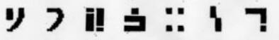

初见杀,没见过这种类型的加密方式.

这是一种特殊的图形密码.

查阅资料得知是标准银河字母加密,
出自于游戏<<指挥官基恩>>系列

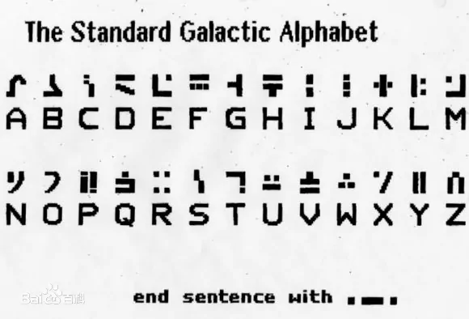

通过对照得到`flag{NOPQRST}`和`flag{nopqrst}`,尝试提交,字母小写版本通过,
答题结束.
## 总结:CTF中的一些图形密码
### 1.传统猪圈密码
猪圈密码又称为亦称朱高密码|共济会暗号|共济会密码或共济会员密码;
是一种以特定符号来替换字母的加密方式

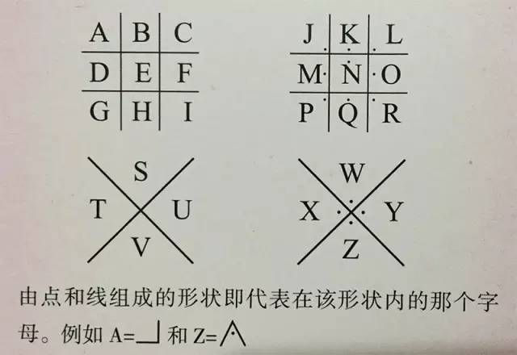

在线解密网址:
<http://moersima.00cha.net/zhuquan.asp>

该密码由于多数出现于一些规模较小的比赛签到题上.

### 2.变种猪圈1
此变种每个图案上均有一小黑点,区别就在于黑点的位置不同.

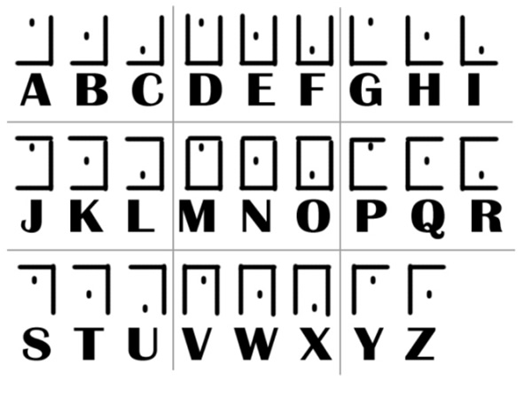

### 3.变种猪圈2
此变种与传统猪圈密码的区别在于第十到第二十二个字母的摆放样式的不同.

.png)

.png)

### 4.圣堂武士密码(猪圈密码的变种)

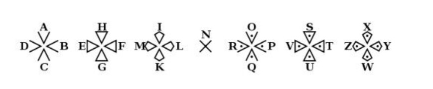

### 5.标准银河字母加密
出自于游戏<<指挥官基恩>>系列


### 6.跳舞的小人
出自于<<福尔摩斯探案集>>跳舞的小人

码表:

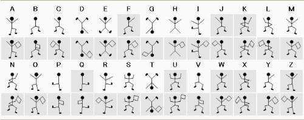

### 7.旗语密码

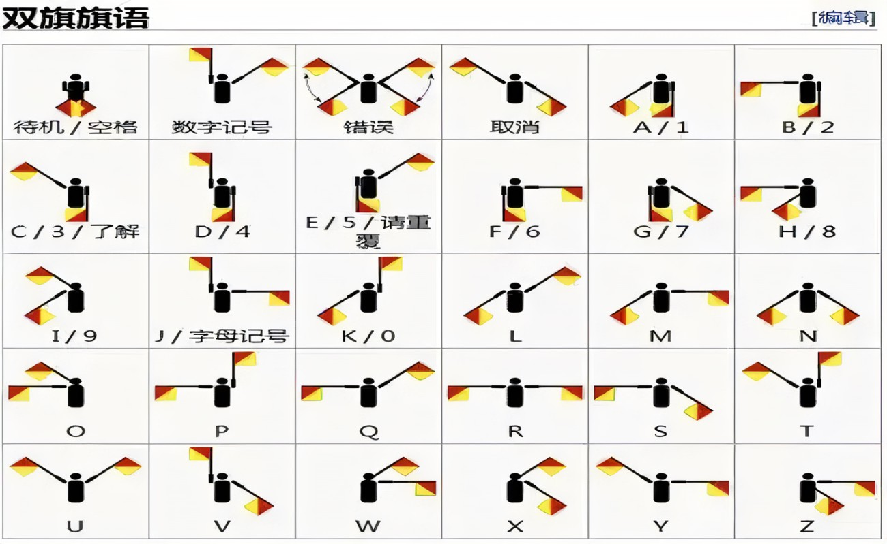

### 8.国际船用信号旗密码

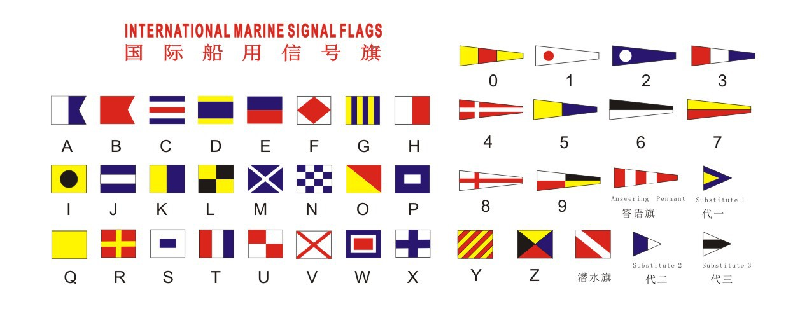

### 9.古埃及象形文字


### 10.夏多密码(又称曲折密码)
来源:作者麦克斯韦·格兰特在中篇小说<<死亡之链>>塑造夏多这一英雄人物中所自创的密码
整个夏多密码由两部分组成

码表

.png)

旋转方向

.png)

1.向上旋转 2.向右旋转 3.向下旋转 4.向左旋转

最后四个符号可以出现在密文中的任意位置,它代表着在此之后的密文需要向什么方向旋转

### 11.狄德拉字符对照表

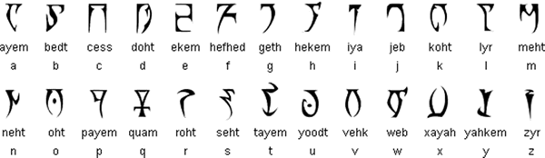

### 12.外星人密码

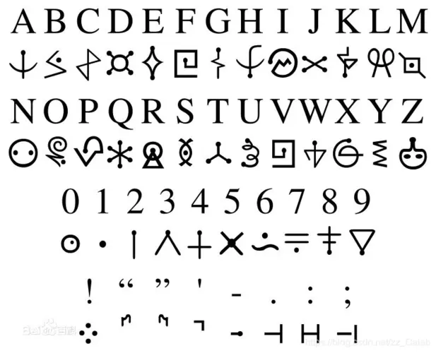

### 13.克林贡语密码
来源:星际迷航

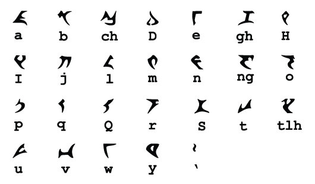

### 14.多斯拉克语字母表
来源:权力的游戏

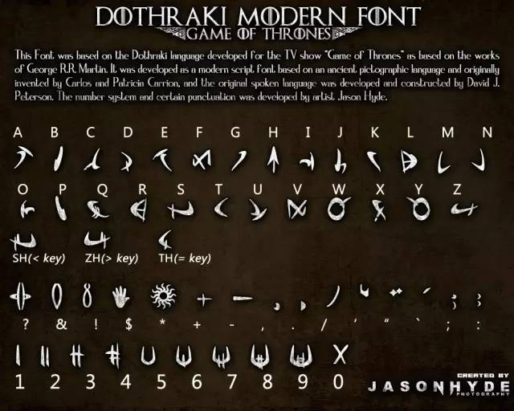

### 15.模拟语
来源:模拟人生4

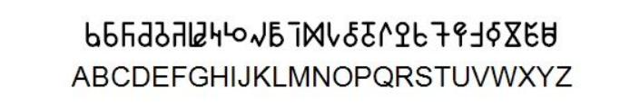

### 16.海利亚语
来源:塞尔达传说

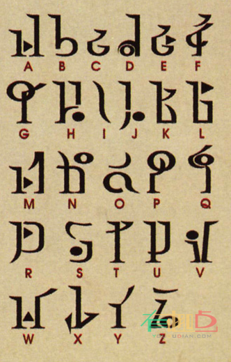

### 17.樊凡语
来源:翡翠帝国

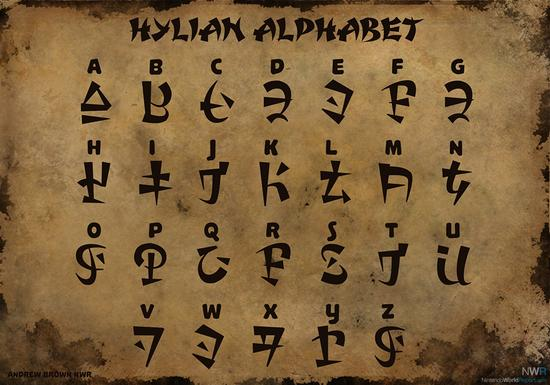

### 18.神奇宝贝密码

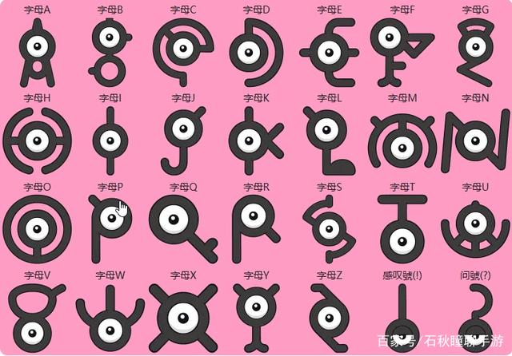

### 19.音符加密

.png)

.png)

### 20.未知加密
只找到一张码表,不知道叫什么名字

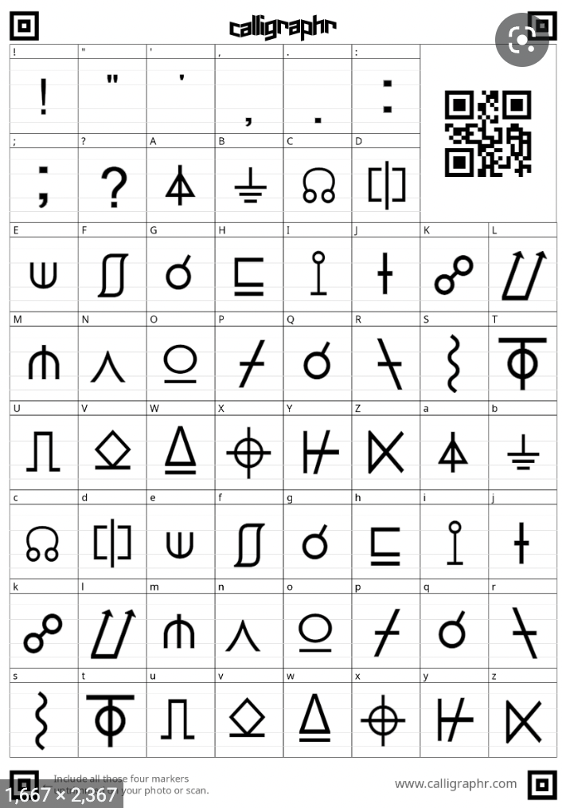

### 21.Covenant字体

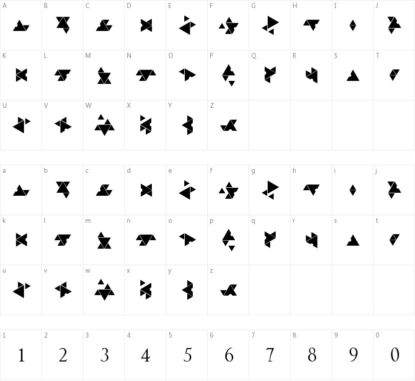

### 22.费兹象形文字

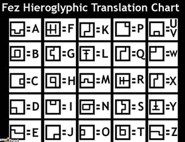

【转载请放链接】:
<https://www.cnblogs.com/Nuy0ah/p/16138118.html>
