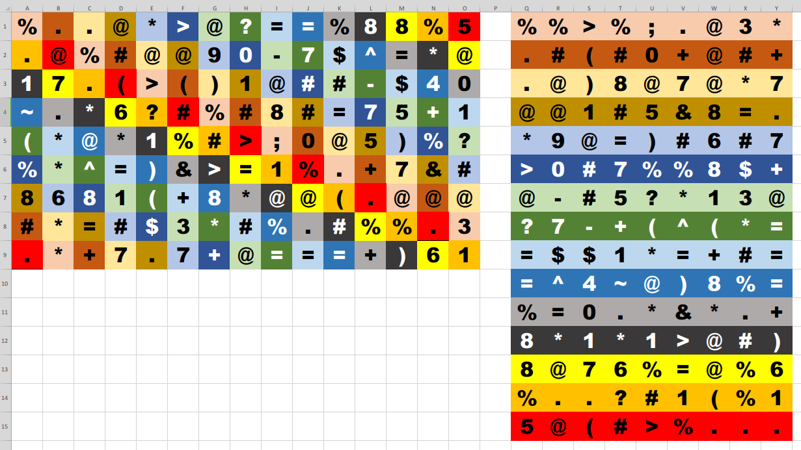
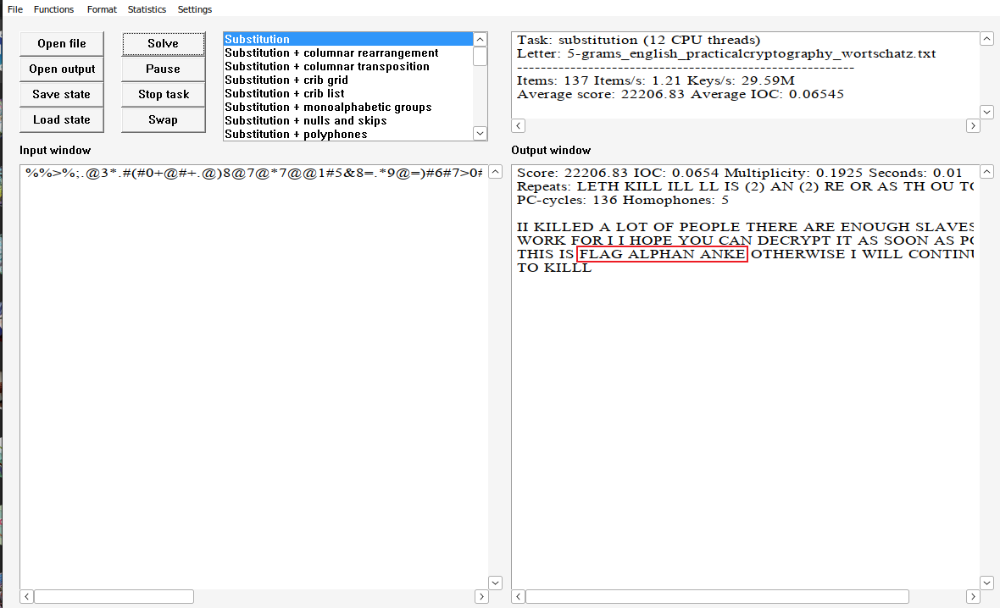

# Crypto-黄道十二宫-解题思路
题目描述:
```
flag{]
```

资源:
`黄道十二宫.jpg`

资源图片如下:


提取其中的关键文字信息,保存为`input.txt`.
```
% . . @ * > @ ? = = % 8 8 % 5
. @ % # @ @ 9 0 - 7 $ ^ = * @
1 7 . ( > ( ) 1 @ # # - $ 4 0
~ . * 6 ? # % # 8 # = 7 5 + 1
( * @ * 1 % # > ; 0 @ 5 ) % ?
% * ^ = ) & > = 1 % . + 7 & #
8 6 8 1 ( + 8 * @ @ ( . @ @ @
# * = # $ 3 * # % . # % % . 3
. * + 7 . 7 + @ = = = + ) 6 1
```

这个图片的文字内容共9行,每行15个字符.
字符的取值范围:[0-9],`!@#$%^&*()+-=?~<>.`

我猜测是`base`家族编码:
```
%..@*>@?==%88%5.@%#@@90-7$^=*@17.(>()1@##-$40~.*6?#%#8#=75+1(*@*1%#>.0@5)%?%*^=)&>=1%.+7&#8681(+8*@@(.@@@#*=#$3*#%.#%%.3.*+7.7+@===+)61
```
使用`base_family.py`尝试解码一下.
```bash
$ python3 ../../Tools/Crypto-base_family/base_family.py -d -v -t "%..@*>@?==%88%5.@%#@@90-7$^=*@17.(>()1@##-$40~.*6?#%#8#=75+1(*@*1%#>.0@5)%?%*^=)&>=1%.+7&#8681(+8*@@(.@@@#*=#$3*#%.#%%.3.*+7.7+@===+)61"
[Base16] 失败: Non-base16 digit found
[Base32] 失败: Non-base32 digit found
[Base64 (标准)] 成功 (二进制): f3ce7dd3b725b35ef5ebcef9fb5d74e75fbbf3af35fbcdfeefbf
[Base64 (URL安全)] 成功 (二进制): f3ce7dd3eedc96cd7bd7eebcef9fb5d74e
[Base85 (ASCII85/Adobe)] 失败: Ascii85 encoded byte sequences must end with b'~>'
[Base85 (RFC 1924 变体)] 失败: bad base85 character at position 1
[Base91] 成功 (二进制): d91997ffef32ceba2bebd58dce6bf795ffd7963ad416772d77a919f8036fcc5a2bfe9ff113d7ba93d573fbd18ea98caf31d4cddfc472927e5db56bdcf330ff2699d9f9a79e5a6d3a314bf23006e6db1998d75ad26d8cb56eabe5bad5f319ffd4a06acb59f74b16a735
[Base58] 失败: 非法 Base58 字符: %
```
看起来又陷入了僵局.

通过查阅相关资料得知:

## 十二宫杀手密码(Zodiac Cipher)
### 核心特点
1. **两层加密**
① **置换(矩阵重排)**:Z340经典行走规则
> 起点左上角,每次读取:**向下+1行,向右+2列**,超出边界对角线循环回绕;
> 作用:打乱明文顺序,就算符号映射破译,直接横着读全是乱码.
② **同音替换密码(Homophonic Substitution)**
多个图形符号可以代表同一个英文字母(用来抵抗频率分析).
> 普通单表替换:E固定一个符号;
> 同音替换:E可以用5~6种不同符号,抹平字符频率.

2. 题型形态
CTF题目一般给一张图片,上面一堆奇怪符号 `@ # % ▲ ■ +`;
做题流程:
① 提取所有字符,排成矩阵;
② **编写脚本按照Z340行走规则重新排序(还原置换)**;
③ 使用 **AZdecrypt**(离线!强烈建议U盘保存)进行替换密码暴力求解;

## CTF赛场标准化解题流程(断网可用)
### 题目标题【黄道十二宫】+ 图片一堆杂符号(Zodiac杀手密码)
1. OCR/手动抄写全部符号,整理成多行矩阵;
2. 运行**矩阵行走重排脚本**;
3. 将重排后的字符串丢入 **AZdecrypt(离线密码分析工具)**;
4. 等待工具输出可读英文,提取flag.

> ⚠️ 必备工具提前放进U盘:AZdecrypt(纯离线,无需联网)

### Z340行走规则矩阵重排原理


根据上述原理,编写`Z340.py`脚本运行,得到单行(从上到下拼接15行)密文文件
`cipher.txt`:
```
$ python3 Z340.py 
=== 最终重排密文 ===
%%>%;.@3*.#(#0+@#+.@)8@7@*7@@1#5&8=.*9@=)#6#7>0#7%%8$+@-#5?*13@?7-+(^(*==$$1*=+#==^4~@)8%=%=0.*&*.+8*1*1>@#)8@76%=@%6%..?#1(%15@(#>%...
已将重排结果保存至 cipher.txt
```

## 重要避坑(比赛极易踩错)
第一步必须先处理**矩阵置换重排**,顺序不对永远解不出.

✅ AZdecrypt是唯一解这类题神器,提前下载便携版放入U盘,断网运行.

将上述重排后的结果保存为`cipher.txt`

由于我使用的是`linux`操作系统,`AZdecrypt`只有`Windows`平台才能使用.
但我还是下载了`AZdecrypt`,我使用`wine`运行它.

`AZdecrypt`下载链接:
<https://www.majorgeeks.com/mg/getmirror/azdecrypt,1.html>

接下来使用`AZdecrypt`进行置换爆破

运行`AZdecrypt`,点击`File>open`,选中`cipher.txt`,然后点击`solve`.

之后就可以查看结果:


如上图所示`FLAG ALPHAN ANKE`,根据`BugKu`上的评论分享,
最终的提交`flag{}`形式为,全小写去除空格,所以最终的`flag`为`flag{alphananke}`.

提交显示通过,答题结束.
