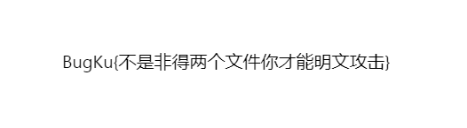

# MISC-请攻击这个压缩包-解题思路

题目描述:
```
提　　示: 没什么好说的,请尝试各种手段攻击我!
描    述:BugKu{}
```
资源:
`file.zip`
## 解题过程
首先检查一下`file.zip`的文件头和是否包含二进制信息追加隐写.
```bash
$ file file.zip 
file.zip: Zip archive data, at least v2.0 to extract, compression method=store

$ binwalk file.zip 

DECIMAL       HEXADECIMAL     DESCRIPTION
--------------------------------------------------------------------------------
0             0x0             Zip archive data, encrypted at least v2.0 to extract, compressed size: 5335, uncompressed size: 5323, name
: flag.png
5463          0x1557          End of Zip archive, footer length: 22
```
发现`flag.png`字样,尝试使用`binwalk -e --dd=".*"`直接拆解`file.zip`.
```bash
$ binwalk -e --dd=".*" file.zip 

DECIMAL       HEXADECIMAL     DESCRIPTION
--------------------------------------------------------------------------------
0             0x0             Zip archive data, encrypted at least v2.0 to extract, compressed size: 5335, uncompressed size: 5323, name
: flag.png
5463          0x1557          End of Zip archive, footer length: 22

$ tree _file.zip.extracted/
_file.zip.extracted/
├── 0
├── 1557
└── flag.png

0 directories, 3 files
```
但是发现`_file.zip.extracted/flag.png`内容是0字节的空文件.

看来方向完全错误了.

使用资源管理器查看`file.zip`的备注信息:没有备注信息.

查看`file.zip`的二进制信息是否包含`flag`字符串:
```bash
$ strings file.zip | rg flag
flag.png
flag.png
```
尝试解压`file.zip`内容到`export`目录下:
```bash
$ unzip file.zip  -d export
Archive:  file.zip
[file.zip] flag.png password: 
   skipping: flag.png                incorrect password
```
发现`file.zip`是一个加密压缩包.

这里怀疑是zip伪加密,将`file.zip`复制为`file.bin`,
并进行加密标记位修改操作(设置为未加密):
```bash
cp file.zip file.bin
```
使用`vim`的`:%!xxd`功能打开`file.bin`:
```bash
1   00000000: 504b 0304 1400 0900 0000 ed45 6355 c668  PK.........EcU.h
                              ^ 修改为0
...
336 000014f0: 7d39 f204 8e88 7fcd 51ec 562a 0250 4b01  }9......Q.V*.PK.
337 00001500: 0214 0014 0009 0000 00ed 4563 55c6 6871  ..........EcU.hq
                           ^ 修改为0
```
修改保存(`:w`并且`%!xxd -r`,继续``)后
解压`file.bin`的内容到`export`目录下:
```bash
$ unzip file.bin -d export
Archive:  file.bin
flag.png:  ucsize 5323 <> csize 5335 for STORED entry
         continuing with "compressed" size value
 extracting: export/flag.png          bad CRC 8af2aebb  (should be cf7168c6)
```
提示:解压出来的`export/flag.png`有`CRC`错误.

猜测是出题人修改了`flag.png`的分辨率,但是没有根据新的分辨率生成`CRC`.

导致出现`CRC`校验不一致的错误提示.

使用工具`fix_png_ihdr.py`进行分辨率爆破,得到正确的分辨率.
```bash
$ python3 ../../Tools/MISC-fix_png_ihdr/fix_png_ihdr.py export/flag.png 
[-] 解析PNG失败: 不是有效的PNG文件
```
奇怪了,检查一下`export/flag.png`的文件类型和是否存在二进制追加隐藏写入:
```bash
$ file export/flag.png
export/flag.png: data

$ binwalk export/flag.png 

DECIMAL       HEXADECIMAL     DESCRIPTION
--------------------------------------------------------------------------------

```
使用资源管理器查看`export/flag.png`的备注信息:
`Failed to load image information`.

检查`export/flag.png`二进制信息中是否含有`flag`字符串:
```bash
$ strings export/flag.png | rg flag

```
使用`vim`的`:%!xxd`查看`export/flag.png`发现是一个不知道文件类型的二进制大文件.
尝试打印可读的字符串,看一下可读字符串有什么有用的信息,
将可读字符串写入到`strings.txt`中:
```bash
$ strings export/flag.png > strings.txt

$ sed -zi "s/\n//g;s/\s//g" strings.txt 

$ cat strings.txt; echo
Qw#x*B*nXXY8OzdI*-~gEoSV_g@<_HcGnhfXgnKH~Pj%\%n;BdezrXCf#ZS7{F["#Mf@x|$rPF0?P*\i@NfmdYscz2\ObRZ+Vf.j"asSsr#m0tN)xVE5Bide$?w}i'x<#,(q~BlI
GJhfZ>C9zHy?a7{XrBPXdM`Kxl_y*VwN>!o#uk&ysyLxImP-YMQ#uV~Am(YO$6*c~n8o*Q[l]/uT;=!lj(W_(o(h&!t@|FmZsII'N2dC-g)yq{G\=$i+^8E`)Z~4df6-S=0#v*kP
h(*H3(^xkZZTanC7GeX3rnJwQc8}!Jh?
```
尝试使用`base_family.py`解码`strings.txt`尝试一下:
```bash
$ python3 ../../Tools/Crypto-base_family/base_family.py -d -i strings.txt -v
[Base16] 失败: Non-base16 digit found
[Base32] 失败: Non-base32 digit found
[Base64 (标准)] 成功 (二进制): 430c419d75d8f0ecdd2201284958077069e17d78272873e39c175eceb5c27d94bb14c7f1acf1743e235f99d62c733d8e6d167e55f
8dab12b2b9b4b4dc5513906275ec22c6a0652062617d90bdcc7c9aed7ac13d774c2b1972570368ba4cacc8bc4898f60c42e5409983ba727f28425fee4
[Base64 (URL安全)] 失败: Incorrect padding
[Base85 (ASCII85/Adobe)] 失败: Ascii85 encoded byte sequences must end with b'~>'
[Base85 (RFC 1924 变体)] 失败: bad base85 character at position 44
[Base91] 成功 (二进制): 2051358202114784d8ea8bac17e89f31389af80ec951fc7e1a6f26eb6ed50ed50fc8b82eb486523f120b1d2c91b4503bc41338481eb9c74f
7cd621895b62492eb1ea14efeb9130c5c4ec638d95cb3093a4a97bc16d06e660d473442fd8b1aae278bf31c65a0cdcfc519a8a205e02892078c9e6d8989a3dd8b32a666a
c8d7c5009f8b4be2f1b6739950f35abf0d9230f60a17a9b3a5270bdc5f89e24d73948da373f505af15e977a3bacb1afd95ef7bce7f31d94eee211212c13825854a6c2948
5e5fb6add871470d8198f71faa5e1ab733ad2dce2bf257582060df7890b4cd7ddba7b08a7422b88c48a0087fdcb0e1
[Base58] 失败: 非法 Base58 字符: #
```
至此,重新思考一下:可能`file.zip`是真加密,而不是伪加密.
我们真正需要的是对`file.zip`进行密码爆破.

使用`ent`命令检查一下`file.zip`和`export/flag.png`的熵值.
熵值越接近`8`,说明压缩率越高,信息越密集.
```bash
$ ent file.zip 
Entropy = 7.954328 bits per byte.

Optimum compression would reduce the size
of this 5485 byte file by 0 percent.

Chi square distribution for 5485 samples is 393.39, and randomly
would exceed this value less than 0.01 percent of the times.

Arithmetic mean value of data bytes is 126.1322 (127.5 = random).
Monte Carlo value for Pi is 3.164113786 (error 0.72 percent).
Serial correlation coefficient is 0.010072 (totally uncorrelated = 0.0).

$ ent export/flag.png 
Entropy = 7.965012 bits per byte.

Optimum compression would reduce the size
of this 5335 byte file by 0 percent.

Chi square distribution for 5335 samples is 260.96, and randomly
would exceed this value 38.53 percent of the times.

Arithmetic mean value of data bytes is 128.0086 (127.5 = random).
Monte Carlo value for Pi is 3.181102362 (error 1.26 percent).
Serial correlation coefficient is -0.025231 (totally uncorrelated = 0.0).
```
使用工具`bkcrack`进行压缩包明文攻击.
首先使用`bkcrack`探查一下是否是`ZipCrypto`加密的压缩包:
```bash
$ ../../Tools/MISC-bkcrack/win64/bkcrack.exe -L ./file.zip
bkcrack 1.8.1 - 2025-10-25
Archive: .\file.zip
Index Encryption Compression CRC32    Uncompressed  Packed size Name
----- ---------- ----------- -------- ------------ ------------ ----------------
    0 ZipCrypto  Store       cf7168c6         5323         5335 flag.png
```
果然是,那么可以使用`bkcrack`对其进行明文攻击.

选取`PNG`标准文件头信息`89504E470D0A1A0A0000000D49484452`(16字节),
通过明文攻击得到`KEY1`,`KEY2`,`KEY3`.
```bash
$ ../../Tools/MISC-bkcrack/win64/bkcrack.exe -C file.zip -c flag.png -x 0 "89504E470D0A1A0A0000000D49484452"
bkcrack 1.8.1 - 2025-10-25
[09:41:14] Z reduction using 9 bytes of known plaintext
100.0 % (9 / 9)
[09:41:14] Attack on 756025 Z values at index 6
Keys: 92802c24 9955f8d6 65c652b8
15.2 % (114896 / 756025)
Found a solution. Stopping.
You may resume the attack with the option: --continue-attack 114896
[09:44:21] Keys
92802c24 9955f8d6 65c652b8
```
通过`KEY1`,`KEY2`,`KEY3`直接导出原始的`flag.png`.
```bash
$ ../../Tools/MISC-bkcrack/win64/bkcrack.exe -C file.zip -c flag.png -k 92802c24 9955f8d6 65c652b8 -d flag.png
bkcrack 1.8.1 - 2025-10-25
[09:55:37] Writing deciphered data flag.png
Wrote deciphered data (not compressed).
```
使用图片查看器查看`flag.png`,图片内容如下:



得到`BugKu{不是非得两个文件你才能明文攻击}`.

尝试提交,提交通过,答题结束.

## bkcrack ZIP已知明文攻击 学习笔记
> 适用场景:CTF|合法自有文件测试;**严禁未经授权破解他人加密文件,存在法律风险**

> 工具:bkcrack仅针对老式 **ZipCrypto(PKWARE传统加密)** ZIP压缩包

> 不支持:AES加密ZIP|RAR|7Z等其他压缩格式

### 一|基础前置知识
1. 攻击原理:已知明文攻击(KPA).加密流 = 明文 ^ 密钥流,拿到一段对应的明文+密文,可还原出加密用的3组内部密钥.
2. 硬性门槛
   - 加密算法:必须为 `ZipCrypto`;AES加密 ZIP **无法使用bkcrack**
   - 需要至少**8字节连续已知明文**
3. 关键区分【压缩方式】(重中之重)
   - Method:`Deflate`(绝大多数情况,文件被压缩后再加密)

     ✅ 可用:原始PNG文件头

     ❌ **不可用PNG文件尾(IEND)**

     原因:加密对象是**压缩后的二进制流**,原始png尾部字节经过deflate压缩完全改变,明文失效
   - Method:`Store`(无压缩,直接加密原始文件)

     ✅ PNG文件头|PNG文件尾 均可作为已知明文,甚至可以头尾同时传入加速破解

### 二|PNG固定特征明文
1. PNG 文件头部(通用首选)
偏移0起始
十六进制:`89504E470D0A1A0A0000000D49484452`
2. PNG 文件尾部 IEND 块(仅Store模式可用)
十六进制:`0000000049454E44AE426082`
长度12字节;使用时偏移 = PNG原始文件大小 − 12

### 三|常用基础命令
#### 1. 查看压缩包信息(第一步必执行)
```bash
./bkcrack -L target.zip
```
重点观察:
- Encryption:ZipCrypto / AES
- Method:Deflate / Store
记录压缩包内目标png文件名

#### 2. 攻击模式1:使用十六进制明文(推荐,无需额外文件)
```bash
./bkcrack -C target.zip -c test.png -x 0 89504E470D0A1A0A0000000D49484452
```
参数说明:
- `-C`:加密压缩包路径
- `-c`:压缩包内被加密文件名称
- `-x 偏移 十六进制明文`

> Store模式下使用文件尾示例:
> 文件原始大小5120,偏移=5120-12=5108
```bash
./bkcrack -C target.zip -c test.png -x 5108 0000000049454E44AE426082
```

> 进阶:Store模式同时传入头部+尾部两段明文,提升求解速度
```bash
./bkcrack -C target.zip -c test.png \
-x 0 89504E470D0A1A0A0000000D49484452 \
-x 5108 0000000049454E44AE426082
```

#### 3. 攻击模式2:使用现成明文文件
```bash
./bkcrack -C target.zip -c test.png -p header.bin -o 0
```
`-p` 明文文件;`-o` 明文在加密文件内的起始偏移

### 四|拿到密钥后的操作
成功运行后输出三组密钥 `KEY1 KEY2 KEY3`
1. 单独解密提取文件
```bash
./bkcrack -C target.zip -c test.png -k KEY1 KEY2 KEY3 -d output.png
```
2. 生成无密码全新zip压缩包
```bash
./bkcrack -C target.zip -k KEY1 KEY2 KEY3 -D new.zip
```
3.(可选)利用密钥反向爆破原始解压密码
```bash
./bkcrack -k KEY1 KEY2 KEY3 -r 长度范围 字符集
## 示例:1~8位大小写+数字
./bkcrack -k KEY1 KEY2 KEY3 -r 1-8 ?a
```

### 五|实战避坑清单
1. AES加密zip直接放弃,bkcrack完全无效;
2. Deflate压缩下,**不要尝试PNG尾部明文攻击**,必然失败;
3. Linux环境压缩包内文件名区分大小写;
4. 偏移数值必须准确,偏移错误直接提示明文不匹配;
5. 报错 `insufficient known plaintext`:明文长度不足或者明文内容错误;
6. bkcrack只支持ZIP,RAR|7z不适用;
7. 优先级策略:
   Deflate → 只用PNG文件头
   Store → 优先文件头;文件头失效再尝试文件尾,或头尾联用

### 六|实战标准流程
1. `bkcrack -L target.zip` 确认加密方式|压缩算法|内部文件名
2. 判断是否满足攻击条件:ZipCrypto加密
3. 判断压缩方式,选择可用明文(头/尾)
4. 执行已知明文攻击获取3组密钥
5. 使用密钥解密文件或生成免密压缩包
6. 需要原始密码时,执行密码回溯爆破
