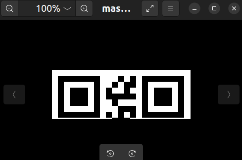

# MISC-闪的好快
网址:
<https://ctf.bugku.com/challenges/detail/id/12.html>

题目描述:
```
提　　示: SYC{}
描　　述: 这是二维码吗?嗯...是二维码了,我靠,闪的好快...
题目来源:第七季极客大挑战
```
资源:
`masterGO.gif`

## 解题过程
首先检查`masterGO.gif`文件头信息和是否存在二进制拼接行为.
```bash
$ file masterGO.gif 
masterGO.gif: GIF image data, version 89a, 280 x 100

$ binwalk masterGO.gif 

DECIMAL       HEXADECIMAL     DESCRIPTION
--------------------------------------------------------------------------------
0             0x0             GIF image data, version "89a", 280 x 100

```
看起来`masterGO.gif`是一个正常的`gif`文件.

接下来查看一下二进制信息是否包含`SYC`(flag格式信息).
```bash
$ strings masterGO.gif | rg SYC

$ strings masterGO.gif | rg flag

```
使用资源管理器查看`masterGO.gif`备注信息:备注信息只有宽度和高度
(280x100 pixels).

使用图片查看器看一下`masterGO.gif`打开是否正常.

如下在此文档中直接插入这张图片:


这里我发现了一个问题:`masterGO.gif`的图片内容是一个会变化的二维码.

但是它在图片查看器打开的时候,只有一半内容.


而插入到当前的markdown文档,被渲染之后显示确实完整的(280x280 pixels).


这显然是不正确的.

这里大胆进行一种猜测:

出题人故意修改了`masterGO.gif`的分辨率为`280x100`.导致二维码显示不全.

而这个动图的实际分辨率是`280x280`.

### `GIF`文件的二进制头格式
1:魔数  (3字节):`47 49 46`:`GIF`文件的魔术头,内容是`GIF`的ASCII码.

2:版本号(3字节):`38 39 61`:版本号(`89a`:`1989/7`;`87a`:`1987/5`)

3.宽度  (2字节):`xx xx`:小端序(高8位在第二个字节)取值范围:`0~65535`

4.高度  (2字节):`xx xx`:小端序(高8位在第二个字节)取值范围:`0~65535`

使用`vim`的`:%!xxd`查看`masterGO.gif`文件的文件头二进制信息:
```
00000000:| 4749 46|38 3961| 1801| 6400 |8800 00ff ffff  GIF89a..d.......
         |MagicNum|Version|Width|Height|
```
因此我们只需要修改图片的高度为与宽度一致即可.

这里其实可以发现如下的问题:

`0x18 0x01 == 280?`

`0x64 0x00 == 100?`

其实这是一个2字节数据排列小端序列问题.

如果调整为高8位在前就非常直观了.

`0x01 0x18 == 2^8+16+8 == 256+24 == 280`

`0x00 0x64 == 6x16+4 == 96+4 ==100`

于是将`masterGO.gif`复制为`masterGO-fixed.gif`,
并将`masterGO-fixed.gif`的高度(第`9&10`字节)从`64 00`修改为`18 01`.

于是我们终于得到了完整的二维码图像:


接下来使用图片/视频编辑工具,将`masterGO-fixed.gif`拆分成独立的二维码静态图片.

视频剪辑工具`shotcut`项目目录是`masterGO-fixed-frame/`,
项目目录结构如下(导出的帧图片也存放在其中):
```bash
$ tree masterGO-fixed-frame
masterGO-fixed-frame
├── masterGO-001.png
├── masterGO-002.png
├── masterGO-003.png
├── masterGO-004.png
├── masterGO-005.png
├── masterGO-006.png
├── masterGO-007.png
├── masterGO-008.png
├── masterGO-009.png
├── masterGO-010.png
├── masterGO-011.png
├── masterGO-012.png
├── masterGO-013.png
├── masterGO-014.png
├── masterGO-015.png
├── masterGO-016.png
├── masterGO-017.png
├── masterGO-018.png
└── masterGO-fixed-frame.mlt

0 directories, 19 files
```
编写`scan_frame.sh`脚本,
调用`scan_code.py`工具遍历扫描`masterGO-fixed-frame/`的所有二维码图片
```bash
#!/bin/bash
shopt -s globstar nullglob dotglob

SCRIPT_DIR=$(dirname "$(readlink -f "$0")")
TARGET_DIR="$SCRIPT_DIR/masterGO-fixed-frame"
SCAN_CODE="$SCRIPT_DIR/../../Tools/MISC-scan_code/scan_code.py"
PYTHON="python3"

# 检查目标目录是否存在
if [[ ! -d "$TARGET_DIR" ]]; then
    echo "错误: 目录 '$TARGET_DIR' 不存在" >&2
    exit 1
fi

# 遍历所有`frame`图片
for file in "$TARGET_DIR"/**/*.png; do
    if [[ -f "$file" ]]; then
        echo "文件: $file"
        "$PYTHON" "$SCAN_CODE" -i "$file"
    fi
done
```

逐个二维码使用工具扫描,查看信息.

```bash
$ ./scan_frame.sh
文件: masterGO-fixed-frame/masterGO-001.png

========== 解码结果 ==========
1. 类型: qrcode
   内容: S

文件: masterGO-fixed-frame/masterGO-002.png

========== 解码结果 ==========
1. 类型: qrcode
   内容: Y

文件: masterGO-fixed-frame/masterGO-003.png

========== 解码结果 ==========
1. 类型: qrcode
   内容: C

文件: masterGO-fixed-frame/masterGO-004.png

========== 解码结果 ==========
1. 类型: qrcode
   内容: {

文件: masterGO-fixed-frame/masterGO-005.png

========== 解码结果 ==========
1. 类型: qrcode
   内容: F

文件: masterGO-fixed-frame/masterGO-006.png

========== 解码结果 ==========
1. 类型: qrcode
   内容: 1

文件: masterGO-fixed-frame/masterGO-007.png

========== 解码结果 ==========
1. 类型: qrcode
   内容: a

文件: masterGO-fixed-frame/masterGO-008.png

========== 解码结果 ==========
1. 类型: qrcode
   内容: S

文件: masterGO-fixed-frame/masterGO-009.png

========== 解码结果 ==========
1. 类型: qrcode
   内容: h

文件: masterGO-fixed-frame/masterGO-010.png

========== 解码结果 ==========
1. 类型: qrcode
   内容: _

文件: masterGO-fixed-frame/masterGO-011.png

========== 解码结果 ==========
1. 类型: qrcode
   内容: s

文件: masterGO-fixed-frame/masterGO-012.png

========== 解码结果 ==========
1. 类型: qrcode
   内容: o

文件: masterGO-fixed-frame/masterGO-013.png

========== 解码结果 ==========
1. 类型: qrcode
   内容: _

文件: masterGO-fixed-frame/masterGO-014.png

========== 解码结果 ==========
1. 类型: qrcode
   内容: f

文件: masterGO-fixed-frame/masterGO-015.png

========== 解码结果 ==========
1. 类型: qrcode
   内容: 4

文件: masterGO-fixed-frame/masterGO-016.png

========== 解码结果 ==========
1. 类型: qrcode
   内容: s

文件: masterGO-fixed-frame/masterGO-017.png

========== 解码结果 ==========
1. 类型: qrcode
   内容: T

文件: masterGO-fixed-frame/masterGO-018.png

========== 解码结果 ==========
1. 类型: qrcode
   内容: }

$ ./scan_frame.sh | rg "内容:" | sed -z "s/内容://g;s/\s//g;s/\n//g;s/\r//g";echo
SYC{F1aSh_so_f4sT}
```
最终得到`SYC{F1aSh_so_f4sT}`,提交通过,答题结束.

## 使用`ffmpeg`直接导出`gif`图片所有帧
上面我使用了视频剪辑软件的方式导出`gif`帧,这样太没有效率了.
可以直接使用如下指令快速导出:
```bash
mkdir export
# %04d代表自动填充(先导0)到4位frame-xxxx.png
ffmpeg -i masterGO-fixed.gif export/frame-%04d.png
```
