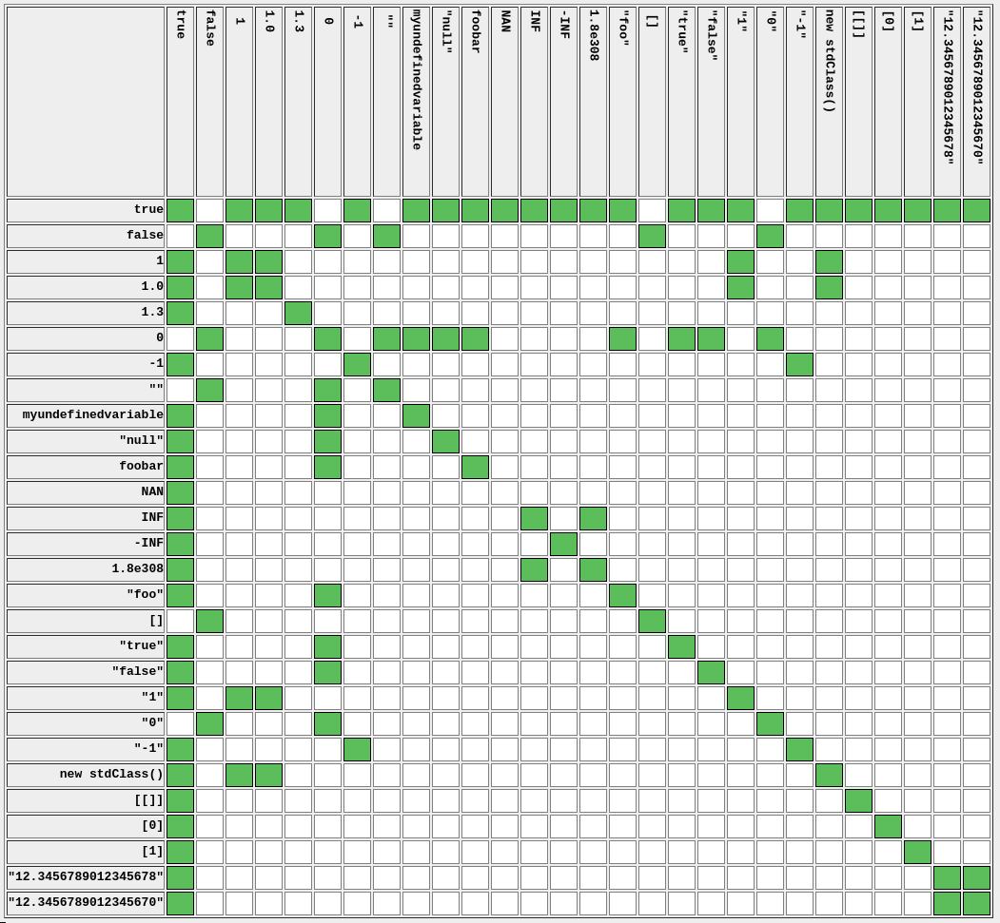
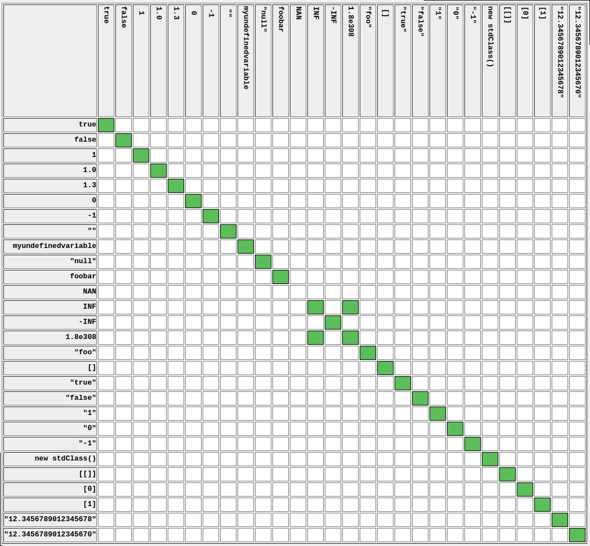

# Web-矛盾-解题思路
题目描述:
```
矛盾
```

打开开发者工具,然后找到源代码界面,点击索引,查看内容:
```html
$num=$_GET['num'];<br>
if(!is_numeric($num))<br>
{<br>
echo $num;<br>
if($num==1)<br>
echo 'flag{**********}';<br>
}<br>
```
上面这段`php`代码的含义是:
```php
$num=$_GET['num'];
if(!is_numeric($num)) // num不是数值类型
{
echo $num;
if($num==1) // num需要在不是数值类型的情况下,==1,才能得到`flag{}`
echo 'flag{**********}';
}
```

这里给出`php ==`和`===`的判断图:





我们分别尝试在地址栏添加查询语句:
`?num="1"`,`?num=true`,`?num=new stdClass()`

发现都无法触发`if($num==1)`这一分支,这有些太奇怪了.
我们详细梳理一下你遇到的困惑和知识盲点,并给出完整解释.  

---

## 一|尝试与失败原因分析

### ① `?num="1"`  
- **实际接收到的值**:字符串 `"1"`(首尾各一个双引号字符,即ASCII 34).  
- `is_numeric($num)` → `false`,因为 `"1"` 不是合法数字字符串(合法数字字符串只能包含数字|正负号|小数点|科学计数法e,不能有引号).  
- 进入 `if`,输出 `$num` 显示为 `"1"`.  
- 判断 `$num == 1`:由于比较一方是数字(1),另一方是字符串,PHP 将字符串转为数字.转换规则是**取字符串开头的数字部分**,如果开头不是数字则结果为 `0`.这里开头是双引号,非数字,所以转为 `0`,`0 == 1` 不成立.  

**结论**:引号被当成普通字符,不会起到"表示数字"的作用.

---

### ② `?num=true`  
- 接收值:字符串 `"true"`.  
- `is_numeric("true")` → `false`.  
- 输出 `true`.  
- 转数字:开头 `t` 非数字 → `0`,`0 == 1` 不成立.  

**结论**:URL 中写 `true` 不会变成布尔类型,它只是普通字符串.

---

### ③ `?num=new stdClass()`  
- 接收值:字符串 `"new stdClass()"`.  
- `is_numeric` → `false`.  
- 转数字:开头 `n` 非数字 → `0`,不成立.  

**结论**:URL 参数无法传递 PHP 对象或表达式,PHP 不会解析执行,只会当作字面字符串.

---

## 二|核心知识点总结

### 1. `$_GET` 永远接收字符串  
无论你在浏览器地址栏写什么,PHP 的 `$_GET['num']` 得到的都是一个**字符串**.  
- 数字 `?num=1` → 字符串 `"1"`  
- 布尔 `?num=true` → 字符串 `"true"`  
- 对象写法 `?num=new stdClass()` → 字符串 `"new stdClass()"`  

所以,所有关于"类型"的考虑,都必须基于**字符串**进行.

---

### 2. `is_numeric()` 的判断规则  
`is_numeric()` 接受字符串或数字,如果参数是**数字**或**纯数字字符串**(允许前导空格|正负号|小数点|科学计数法),则返回 `true`,否则 `false`.  
例如:  
- `"1"` → true  
- `"1.0"` → true  
- `"1e3"` → true  
- `"+123"` → true  
- `" 123"` → true(有前导空格)  
- `"123abc"` → false(包含非数字字符)  
- `"true"` → false  
- `"\"1\""` → false(包含引号)  

本题要求 `!is_numeric($num)` 为真,所以我们必须传一个**不是纯数字字符串**的值.

---

### 3. 字符串转数字的规则(弱比较 `==` 时)  
当使用 `==` 比较一个数字和一个字符串时,PHP 会**将字符串转为数字**,转换规则如下:  
- 取字符串**开头的连续数字部分**(包括正负号|小数点|科学计数法 e)作为数值.  
- 如果开头没有任何数字(或符号),则结果为 `0`.  
- 转换会忽略开头空格,但遇到第一个非数字字符(除 e 和点外)即停止.  

例子:  
- `"123abc"` → `123`  
- `"1.5abc"` → `1.5`  
- `"abc"` → `0`  
- `" true"` → `0`(开头空格后是 t,非数字)  
- `"1e2abc"` → `100`(科学计数法有效)  
- `"+1abc"` → `1`(正号有效)  
- `"01abc"` → `1`(前导0有效)  

本题需要 `$num == 1`,所以我们要让字符串转数字后等于 `1`,同时又要让 `is_numeric` 返回 `false`.  
因此,构造一个以数字 `1` 开头,但后面紧跟非数字字符的字符串即可,例如 `"1abc"`.

---

### 4. 为什么 `?num=1abc` 成功?  
- 接收值:`"1abc"`  
- `is_numeric("1abc")` → `false`(因为含有字母)  
- 进入 `if`,输出 `1abc`  
- 比较 `"1abc" == 1`:字符串转数字,取开头数字 `1`,得到 `1`,`1 == 1` 成立  
- 输出 `flag{...}`  

---

## 三|其他可用的 payload(原理相同)

- `?num=1.0abc` → 转数字 `1.0` → 等于1  
- `?num=+1abc` → 转数字 `1`  
- `?num=01abc` → 转数字 `1`  
- `?num=1e0abc` → 转数字 `1`(因为 1e0 = 1)  
- `?num=1%00`(URL编码的空字符)→ 转数字 `1`,但 `%00` 非数字,
`is_numeric` 为 false(注意 `%00` 在字符串中可能被忽略,但具体看配置,建议用字母)  
- `?num=1.0.0` → 转数字 `1.0`(遇到第二个点停止)  

---

## 四|误解的深层原因

误以为在 URL 中写 `"1"` 或 `true` 就能让 PHP 识别为对应的类型
(字符串字面量或布尔值),但**HTTP 参数传递只传输纯文本**,
PHP 不会自动解析 JSON 或表达式.  

或许把浏览器地址栏当作 PHP 代码执行环境,但实际上它只是普通的查询字符串.

另外,对弱比较的转换规则不熟悉,以为 `"1"`(带引号)会等于数字 1,
但注意引号本身是字符,被当作开头,导致转换失败.

---

## 五|加强理解的小结表

| URL 参数            | `$_GET['num']` 实际值 | `is_numeric` | `$num == 1` 时字符串转数字 | 结果 |
|---------------------|-----------------------|--------------|---------------------------|------|
| `?num=1`            | `"1"`                 | true         | 不比较(因为不进入if)     | 无 flag |
| `?num="1"`          | `"\"1\""`             | false        | 开头 `"` → 0              | 失败 |
| `?num=true`         | `"true"`              | false        | 开头 `t` → 0              | 失败 |
| `?num=new stdClass()`| `"new stdClass()"`   | false        | 开头 `n` → 0              | 失败 |
| `?num=1abc`         | `"1abc"`              | false        | 开头数字 `1` → 1          | **成功** |
| `?num=abc1`         | `"abc1"`              | false        | 开头 `a` → 0              | 失败 |

---

## 六|最终答案

直接访问:

```
http://靶场地址/?num=1abc
```
即可拿到 flag.

```html
$num=$_GET['num'];<br>
if(!is_numeric($num))<br>
{<br>
echo $num;<br>
if($num==1)<br>
echo 'flag{**********}';<br>
}<br>

1abcflag{fec8d0deaf0eeab077e7beb361d310c4}
```
至此答题结束.
