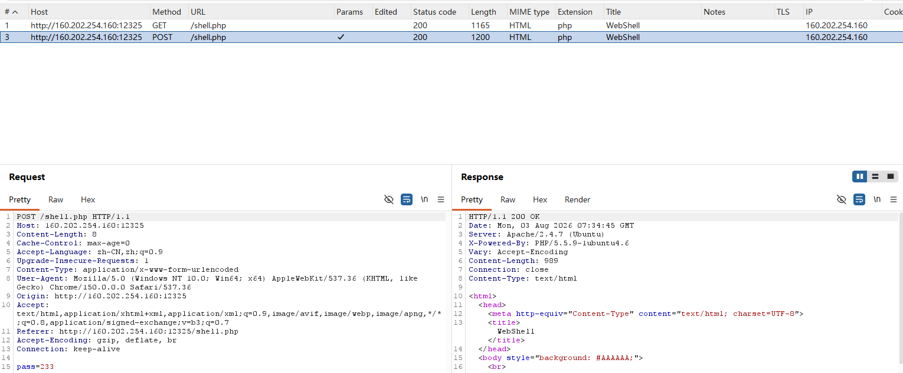

# Web-网站被黑-解题思路
网址:
<https://ctf.bugku.com/challenges/detail/id/78.html>

题目描述:
```
描述:网站被黑了 黑客会不会留下后门
```
资源:
`启动场景`
## 解题过程
网站是一个动态网页,内容是显示:网站被黑了,请及时修复.

显示了一张图片,还有就是会有鼠标跟随动效.

网站资源已经全部下载到`website`目录下.

打开网络选项卡,右键网址`200`状态码的网路请求,
鼠标右键复制响应标头,内容如下:
```
HTTP/1.1 200 OK
Date: Mon, 03 Aug 2026 02:50:37 GMT
Server: Apache/2.4.7 (Ubuntu)
X-Powered-By: PHP/5.5.9-1ubuntu4.6
Vary: Accept-Encoding
Content-Encoding: gzip
Content-Length: 4801
Connection: close
Content-Type: text/html
```
发现是`PHP`后台服务器.

之后检查所有的网页资源没有发现`flag{}`的任何线索:
```bash
$ rg flag website
$
```
黔驴技穷,直接使用`dirsearch`进行网站资源搜索.
```bash
$ dirsearch -u http://160.202.254.160:12368/ -e php,js

  _|. _ _  _  _  _ _|_    v0.5.0
 (_||| _) (/_(_|| (_| )

Extensions: php, js | HTTP method: GET | Threads: 25 | Wordlist size: 10163

Target: http://160.202.254.160:12368/

[11:29:24] Scanning: 
[11:34:26] 200 -   19KB - /index.php                                     
[11:34:27] 200 -   19KB - /index.php/login/                              
[11:36:26] 403 -   299B - /server-status/                                
[11:36:31] 200 -   954B - /shell.php                                     
                                                                          
Task Completed
```
发现可疑的`shell.php`文件,尝试地址栏直接访问`/shell.php`.

得到如下响应:
```html
<html>
<head>
<meta http-equiv="Content-Type" content="text/html; charset=UTF-8">
<title>WebShell</title>
</head>
<body style="background: #AAAAAA;">
	<br>
	<center>
		<form method="POST">
			<div
				style="width: 351px; height: 201px; margin-top: 100px; background: threedface; border-color: #FFFFFF #999999 #999999 #FFFFFF; border-style: solid; border-width: 1px;">
				<div
					style="width: 350px; height: 22px; padding-top: 2px; color: #FFFFFF; background: #293F5F; clear: both;">
					<b>WebShell</b>
				</div>
				<div
					style="width: 350px; height: 80px; margin-top: 50px; color: #000000; clear: both;">
					PASS:<input type="password" name="pass" style="width: 270px;">
				</div>
				<div style="width: 350px; height: 80px; clear: both;">
					<input type="submit" value="登录" style="width: 80px;">
				</div>
				<center>
					<span style="color: red;">
										</span>
				</center>
			</div>
		</form>
	</center>

</body>
</html>
```
尝试使用万能`SQL`密码:`' or 1=1#`进行注入,返回如下响应:
```html
<html>
<head>
<meta http-equiv="Content-Type" content="text/html; charset=UTF-8">
<title>WebShell</title>
</head>
<body style="background: #AAAAAA;">
	<br>
	<center>
		<form method="POST">
			<div
				style="width: 351px; height: 201px; margin-top: 100px; background: threedface; border-color: #FFFFFF #999999 #999999 #FFFFFF; border-style: solid; border-width: 1px;">
				<div
					style="width: 350px; height: 22px; padding-top: 2px; color: #FFFFFF; background: #293F5F; clear: both;">
					<b>WebShell</b>
				</div>
				<div
					style="width: 350px; height: 80px; margin-top: 50px; color: #000000; clear: both;">
					PASS:<input type="password" name="pass" style="width: 270px;">
				</div>
				<div style="width: 350px; height: 80px; clear: both;">
					<input type="submit" value="登录" style="width: 80px;">
				</div>
				<center>
					<span style="color: red;">
					*不是自己的马不要乱骑！*					</span>
				</center>
			</div>
		</form>
	</center>

</body>
</html>
```
得到了嘲讽:`*不是自己的马不要乱骑！*`.

接下来使用地址栏分别访问`index.php`和`index.php/login`,发现内容并无异常.
已分别保存到`website/`和`website/Scripts/`下.

看来这个题目的重点在于攻破`shell.php`的这个`webshell`密码框.
使用`burpsuite`进行密码爆破,爆破之后.得到`flag{}`字符串:
`flag{e506e1669c724da9c6fa6524fa097d1b}`.

提交通过,答题结束.

## `burpsuite`密码爆破的流程
打开`burpsuite`,勾选`Temporary project in memory`,然后直接点击`next`.

勾选`Use Burp defaults`,然后点击`Start Burp`.

进入`burpsuite`主界面之后,点击`Proxy`选项卡,点击子界面下的`Open browser`.

打开`burpsuite`内置浏览器之后,在地址栏输入目标地址.

尝试在目标地址登录一次,登录失败之后,回到`burpsuite`主界面.

点击`Proxy`选项卡下的子选项`HTTP history`,查看到如下的请求:



选中包含登录密码的请求,(上图是第二个`POST`请求,包含`pass=233`字符串),
选中后鼠标右键选择`Send to Intruder`.

然后点击`Intruder`选项卡,在`Positions`字样后面有`Add $`按钮.
在`pass=233`的`233`左右添加`$`,为`pass=$233$`.

这个`$xxx$`的含义是一会儿使用字典爆破的时候,密码字典中的每一行内容替换`xxx`,
作为密码进行爆破.

设置`$`后会弹出一个`Payloads`子窗口界面,
在`Payload configuration`选项卡下点击`Load`按钮导入密码字典的文本文件.

然后点击右上角的`Start attack`按钮开始攻击(暴力破解).

此时会弹出一个`Attack`子窗口.里面展示了正在尝试和已经尝试过的所有的密码
和得到的请求信息.

当攻击完成之后,点击`Request`字样同行的`length`进行升序或者降序排列.

找到响应长度最与众不同的那个请求,就是最终的密码.
